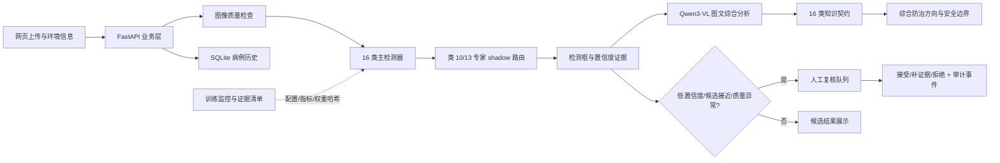

# 比赛材料：系统架构、数据治理与创新点

## 1. 项目定位

“田诊协同”面向第三届“农信杯”题目二，目标是把一张田间照片转化为可复核的诊断证据链，而不是输出一个无法解释的类别字符串。系统覆盖 16 类病害与害虫，采用“视觉定位 → 多模型协同 → 来源可追溯的综合防治方向 → 人工复核”的闭环。

最终交付坚持三个边界：官方冻结验证集不被调参污染；图像识别结果始终标为候选线索；没有当地标签和植保人员核验时，不生成具体药剂、剂量、混配、施用次数或安全间隔。

## 2. 系统架构

### 运行时职责

| 层 | 主要职责 | 失效时的安全行为 |
| --- | --- | --- |
| 网页 | 图片预览、环境信息、框和置信度展示、知识来源、人工复核 | 后端不可达时显示“本地服务未启动”，不伪造识别结果 |
| FastAPI | 上传校验、图像质检、病例保存、复核 API、知识契约 API | 模型不可用时保存 `model_unavailable`，附带复核原因 |
| 主检测器 | 在官方 16 类空间定位候选目标 | 无目标仍进入人工复核，不把空结果当成“健康” |
| 专家模型 | 对类 10/13 候选进行独立证据补充 | 当前仅 `shadow`，不覆盖主模型结论 |
| Qwen3-VL | 综合原图、检测框、置信度、作物/部位/生育期/环境和备注，输出严格结构化解释 | 端点失败时保留病例与检测；同名/异名一致性由后端复核，既有风险不得降低 |
| 知识契约 | 提供逐类观察重点、综合防治方向和来源 ID | 只输出 orientation，不越过产品标签边界 |
| 监控/证据 | 保存运行、配置、指标、权重 SHA-256 与服务器健康快照 | 证据不完整时不得晋级 active 路由 |

## 3. 数据治理与可复现划分

| 数据口径 | 规模 | 用途 | 治理规则 |
| --- | ---: | --- | --- |
| 官方数据全集 | 4,164 张图、5,920 个框、16 类 | 建立任务类别空间 | 原始文件只读，不进入公开仓库 |
| 官方训练集 | 3,321 张 | 训练主模型 | 固定种子 `20260729`，不因后续结果重划分 |
| 官方冻结验证集 | 833 张 | 主模型最终比较 | 永久冻结，只报告一次最终指标 |
| 冲突隔离样本 | 10 张 | 数据审计 | 保留隔离清单，不改写官方文件 |
| 独立 tune | 101 张 | 类 10/13 阈值选择 | 只用于选择配置，不作最终泛化结论 |
| 独立 frozen | 85 张 | 类 10/13 一次性门控 | 本轮结果未通过，故不启用 active |
| 类 13 复核记录 | 142 条复核记录；最终冻结 69 tune + 69 frozen = 138 张 | 许可、框质量、去重和人工门控 | 只保留清单/审计元数据，原图不公开 |

公开仓库只保存代码、划分元数据、来源与许可证登记、派生标量指标和可重跑脚本。原始图像、标签、权重、ONNX、运行数据库、日志、密钥和大归档遵循 `PUBLICATION_POLICY.md`，留在受控服务器或备份中。

## 4. 实验对比与当前生产证据

官方冻结 833 张验证集上的主模型证据如下；单张无标签田间图片只用于网页 E2E，不计入准确率。

| 模型/链路 | Precision | Recall | mAP50 | mAP50-95 | 结论 |
| --- | ---: | ---: | ---: | ---: | --- |
| 官方 YOLO26n 基线 | 0.733906 | 0.683310 | 0.705030 | 0.425336 | 基线 |
| 生产主模型（16 类） | 0.839196 | 0.776205 | 0.827517 | 0.548224 | 当前最佳保留主模型 |
| 独立类 10/13 校准候选（85 frozen） | — | — | — | 0.051258 总体；类 10 0.363993；类 13 0 | frozen 门拒绝 |

当前保留模型角色为 4 个：官方基线、生产主模型、类 10 检测专家、类 10/13 crop 分类专家。训练监控证据中已知训练实验为 12 个；二者分别代表“实验数量”和“可部署角色”，不能混为模型数量。

性能与部署证据：主模型 PT 约 5.145 MiB，类 10 专家约 5.134 MiB，crop 专家约 3.042 MiB，三份 PT 合计约 13.321 MiB；主模型 ONNX 约 10.101 MiB。RTX 5090 独立 PT 基准为 batch 1/8/32 吞吐 190.246/380.474/368.962 images/s；shadow 路由顺序压测 20/20 成功、均值 121.501 ms、p95 142.248 ms、8.082 req/s，并发 24/24 成功、p95 233.521 ms、29.572 req/s。服务空闲显存快照约 729 MiB，单独主模型基准峰值约 2,587.94 MiB。

Phase 8 真实多模态证据从官方冻结验证集按 16 类各抽 10 张：160/160 请求成功，端到端 Top-1 86.25%，结构校验率 100%，关键内容非空率 58.13%，人工复核触发 132/160；VLM P50/P95 为 2.238/2.757 秒，完整链路 P50/P95 为 2.326/2.949 秒，顺序/并发 2 吞吐为 0.429/0.841 张每秒。峰值显存 24,024 MiB，Qwen3-VL 模型目录约 16.34 GiB。对 17 个主检测错误样本只识别出 1 个冲突（5.88%），因此多模态解释目前不能作为 active 路由晋级依据。

## 5. 可呈现的创新点

1. **证据化多模型协同**：主检测器负责定位，类 10/13 专家只对候选补充证据；路由记录模式、阈值、温度、候选数、耗时和模型 SHA-256。
2. **独立数据门控而非盲目重训**：tune 集只选配置，frozen 集只做一次比较；本轮 frozen 未通过，系统保留主模型并禁止 active，避免把局部收益包装成整体提升。
3. **可信知识输出**：16 类卡片有来源 ID、复核日期、观察重点和综合防治方向；明确“图像是候选线索”，不从图像推导药剂或剂量。
4. **人机复核闭环**：低置信度、候选接近、无目标和质量异常自动进入队列；人工可选择接受、请求补充证据或拒绝，证据快照和 reviewer ID 进入审计事件。
5. **离线可降级、可恢复**：网页、后端、推理服务分别有健康边界；服务中断时只提示等待/复核，不写入虚构结论，恢复后可继续读取历史病例。
6. **真实多模态端点与可测闭环**：Qwen3-VL 通过仅监听服务器回环地址的 vLLM OpenAI 兼容接口提供服务；网页一键串联上传、检测、分析和保存，正式分层脚本同时采集准确率、结构完整性、延迟、吞吐、显存和模型大小。

## 6. 必须主动说明的限制

- 当前 active 路由不允许，生产服务保持 `shadow`；类 10/13 独立 frozen 门未通过。
- 多模态在分层样本上的错误冲突识别率仅 5.88%，容易受检测候选锚定；当前只用于解释、补证据和复核触发，不作为自动纠错器。
- 类 13 在当前独立 frozen 评估中仍为 0，不能宣称所有弱类都已提升。
- 知识卡片是通用 IPM orientation，不替代现场诊断、实验室检测、当地植保部门或现行产品标签。
- 公开仓库是代码与复现元数据真源，不是原始数据和权重分发渠道。
