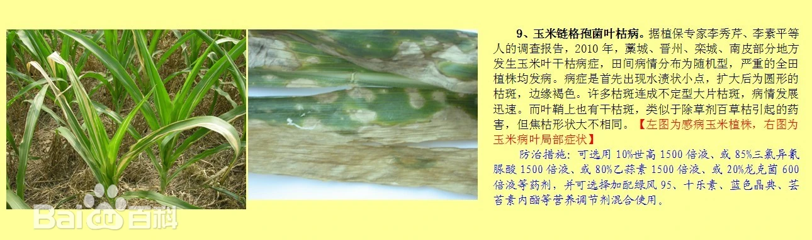

# 玉米叶枯病

|   中文名   | 玉米叶枯病         | 为害作物     | 玉米             |
| :--------: | ------------------ | ------------ | ---------------- |
| **外文名** |                    | **为害部位** | 叶片、叶鞘及苞叶 |
| **别  名** | 玉米链格孢菌叶枯病 | **病  原**   | 半知菌亚门真菌   |

## 为害症状

​	初期病部现水渍状小圆斑点，逐渐扩展成椭圆形至近圆形的病斑，中央灰白色至秸白色，边缘红褐色，病健部交界明显。病斑扩展不受叶脉限制，大小6～13×4～8微米。后期病部可见黑色霉层，一些病斑中间破裂穿孔，严重的整株叶片病斑满布，呈撕裂状干枯坏死。

|  |
| :------------------------------ |

## 防治方法

### 农业防治

1. 培育、选择抗病品种。
2. 按配方施肥要求，充分施足基肥，适时追肥。

### 化学防治

1. 喷洒75%百菌清可湿性粉剂600倍液或50%扑海因可湿性粉剂1000倍液、50%速克灵可湿性粉剂1500倍液、70%代森锰锌可湿性粉剂500倍液，隔7—15天1次，防治2～3次。
2. 可选用10%世高1500倍液、或85%三氯异氰脲酸1500倍液、或80%乙蒜素1500倍液、或20%龙克菌600倍液等药剂，并可选择加配绿风95、十乐素、蓝色晶典、芸苔素内酯等营养调节剂混合使用。
