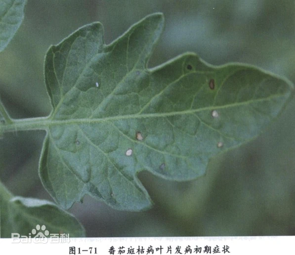
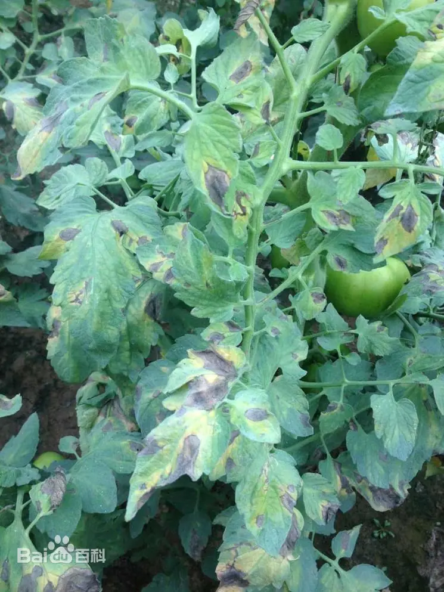

# 番茄斑枯病

|   中文名   | 番茄斑枯病                | 为害作物         | 番茄                               |
| :--------: | ------------------------- | ---------------- | ---------------------------------- |
| **外文名** | Tomato Septoria leaf spot | **常见为害部位** | 叶片、茎、叶柄、花萼，偶可涉及果实 |
| **别  名** | 鱼目斑病、白星病、斑点病  | **病  原**       | 番茄壳针孢菌 *Septoria             |

## 为害症状

​	番茄斑枯病主要危害[叶片](https://baike.baidu.com/item/叶片/6728903?fromModule=lemma_inlink)，也能危害[茎](https://baike.baidu.com/item/茎/35355?fromModule=lemma_inlink)和[花萼](https://baike.baidu.com/item/花萼/6731030?fromModule=lemma_inlink)。叶片发病多从植株下部开始。病初在叶背面产生水浸状圆形小斑点，随后叶正、反两面出现圆形或近圆形病斑，边缘深褐色，中部灰白色，稍凹陷，并散生许多墨色小粒点，直径2-3毫米，病斑形似鱼眼。严重时叶片布满斑点，叶片退绿变黄，引起早期脱落。茎上病斑呈椭圆形，褐色。果实发病出现褐色圆形病斑。

|  |  |  |  |
| ------------------------------- | ------------------------------- | ------------------------------- | ------------------------------- |

## 特征

​	中国上海及长江中下游地区番茄斑枯病的主要发病盛期在4-6月及9-11月。常年春季发生重于秋季，年度间早春多雨或梅雨期间多雨的年份发病重；秋季多雨、多雾的年份发病重；田块间连作地、排水不良的田块发病较早较重；栽培上种植过密、通风透光差、土壤缺肥，植株生长衰弱的田块发病重。

​	番茄斑枯病对湿度要求较高，病菌释放分生孢子及孢子萌发均要求有水滴的存在，在温暖多雨季节蔓延迅速，梅雨季节易盛发流行。温暖潮湿和阳光不足的阴天，也有利于病害的发生。当日均气温在15℃以上，遇阴雨天气，特别是雨后转晴，病害容易流行。在高温干燥气候条件下，病害的发展会受到抑制

## 防治方法

### 轻度

1. 及时摘除最下部和少量明显病叶并带出田间，减少分生孢子来源。[05-T1]
2. 增加植株间通风，避免过密种植；采用根部灌水、滴灌或沟灌，尽量减少叶面长期湿润和水滴飞溅。[05-T1]
3. 对病害刚出现的田块加强巡查，避免在叶片湿润时进行整枝等操作。
4. 如需早期药剂保护，可选择当前登记用于番茄斑枯病的杀菌剂；国内蔬菜用药指南给出了**37%苯醚甲环唑水分散粒剂**用于番茄斑枯病的喷雾示例。[05-T2]

### 中度

> 适用范围：以下内容仅作为当前确认样本的可选一般指导；不得依据当前样本自动选择治疗层级。涉及药剂时，须由用户确认目标作物并核对当前产品标签及登记适用范围。

1. 连续清除病斑较密集的下部叶片，重点保护中上部健康叶片。[05-T1]
2. 控制叶面湿润时间，减少喷灌和雨水飞溅传播条件。[05-T1]
3. 可按当前产品登记标签使用番茄斑枯病药剂；历史官方指南示例为 37%苯醚甲环唑水分散粒剂 9.5–12 克/亩喷雾，但实际应用必须核对当前产品标签。[05-T2]
4. 需要继续施药时，按标签轮换不同作用机制，不自行增加频次。
### 重度

> 适用范围：以下内容仅针对当前确认样本及其可见组织；当前样本的重度观察不自动推断大面积、产量、采收期或区域防控。涉及药剂时，须由用户确认目标作物并核对当前产品标签及登记适用范围。

1. 重点保护仍健康的功能叶，持续加强通风、排湿、减少叶面淋水。[05-T1]
2. 使用当前登记的番茄斑枯病杀菌剂规范防治，不因重度提高剂量。[05-T2]
### 防治措施来源

**[05-T1] B**

title: Septoria Leaf Spot of Tomatoes

site: University of Maryland Extension

url: https://www.extension.umd.edu/resource/septoria-leaf-spot-tomatoes

**[05-T2] A**

title: 蔬菜绿色生产病虫害防治用药指南

site: 怀化市农业农村局

url: https://www.huaihua.gov.cn/nyncj/c108787/202101/a2bc0e93fd334af3ad2dbc911bfa9c52.shtml

## R3.1 严重度证据

本轻/中/重规则为基于可靠农业资料整理形成的系统辅助判定规则，并非宣称原始资料本身采用相同三级分级。

### 轻度

- 状态：COMPLETE；番茄下部叶片出现少量小的圆形灰色病斑，边缘较深。
- 可观察特征：下部叶片；小圆形灰色病斑；深色边缘。
- 证据类型：EVIDENCE_SYNTHESIZED；来源：[R31-PLANT-01-SYM]。
- 证据整理说明：evidence_synthesized：来源直接描述从下部叶片小病斑开始。

### 中度

- 状态：COMPLETE；病斑扩大并相互融合，叶片开始黄化，病斑内可见黑色小粒点。
- 可观察特征：病斑扩大；病斑融合；叶片黄化；黑色小粒点。
- 证据类型：EVIDENCE_SYNTHESIZED；来源：[R31-PLANT-01-SYM]。
- 证据整理说明：evidence_synthesized：依据来源的 enlarge/coalesce/yellow 进展整理；不写入面积比例。

### 重度

- 状态：COMPLETE；叶片普遍黄化并死亡，出现明显早期落叶或严重叶部枯死。
- 可观察特征：叶片普遍黄化；叶片死亡；早期落叶。
- 证据类型：EVIDENCE_SYNTHESIZED；来源：[R31-PLANT-01-SYM]。
- 证据整理说明：evidence_synthesized：来源明确描述病斑可导致叶片黄化和死亡，并指出严重枯叶可减少产量。
