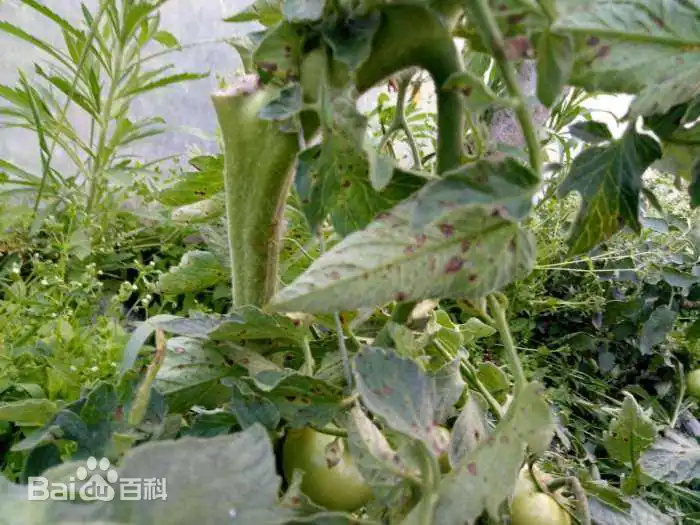
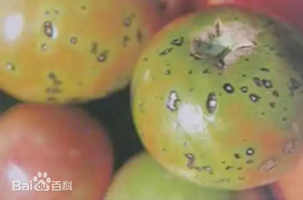

# 番茄斑枯病

|   中文名   | 番茄斑枯病               | 为害作物     | 番茄           |
| :--------: | ------------------------ | ------------ | -------------- |
| **外文名** | Tomato septorial blight  | **为害部位** | 叶片、茎和花萼 |
| **别  名** | 鱼目斑病、白星病、斑点病 | **病  原**   | 番茄壳针孢菌   |

## 为害症状

​	番茄斑枯病主要危害[叶片](https://baike.baidu.com/item/叶片/6728903?fromModule=lemma_inlink)，也能危害[茎](https://baike.baidu.com/item/茎/35355?fromModule=lemma_inlink)和[花萼](https://baike.baidu.com/item/花萼/6731030?fromModule=lemma_inlink)。叶片发病多从植株下部开始。病初在叶背面产生水浸状圆形小斑点，随后叶正、反两面出现圆形或近圆形病斑，边缘深褐色，中部灰白色，稍凹陷，并散生许多墨色小粒点，直径2-3毫米，病斑形似鱼眼。严重时叶片布满斑点，叶片退绿变黄，引起早期脱落。茎上病斑呈椭圆形，褐色。果实发病出现褐色圆形病斑。

|  |  |  |  |
| ------------------------------- | ------------------------------- | ------------------------------- | ------------------------------- |

## 特征

​	中国上海及长江中下游地区番茄斑枯病的主要发病盛期在4-6月及9-11月。常年春季发生重于秋季，年度间早春多雨或梅雨期间多雨的年份发病重；秋季多雨、多雾的年份发病重；田块间连作地、排水不良的田块发病较早较重；栽培上种植过密、通风透光差、土壤缺肥，植株生长衰弱的田块发病重。

​	番茄斑枯病对湿度要求较高，病菌释放分生孢子及孢子萌发均要求有水滴的存在，在温暖多雨季节蔓延迅速，梅雨季节易盛发流行。温暖潮湿和阳光不足的阴天，也有利于病害的发生。当日均气温在15℃以上，遇阴雨天气，特别是雨后转晴，病害容易流行。在高温干燥气候条件下，病害的发展会受到抑制

## 防治方法

### 农业防治

1. 茬口轮作：苗床用新土或2年内未种过茄科蔬菜的阳畦或地块育苗。提倡与非茄科蔬菜2-3年轮作，以减少田间病菌来源。
2. 留种与种子消毒：从无病留种株上采收种子，选用无病种子。引进的商品种子在播前干种子用2.5%咯菌腈悬浮种衣剂（适乐时）包衣，包衣使用剂量为千分之3-4‰，包衣后晾干播种；或用52℃温汤浸种30分钟后，取出晾干后催芽播种。
3. 栽培措施：深沟高畦，防止雨后积水引发病害，合理密植增加田间通风透光，合理用肥，适当增施磷钾肥，提高植株抗病性。
4. 清洁田园：定期摘除病、老叶。采收后要彻底清除田间病株残余物和田边杂草，并深翻土壤，加速病残体的腐烂分解。集中沤肥，经高温发酵和充分腐熟后方能施入田内。
5. 生态调控防治：管棚和连栋大棚及温室栽培要控制大棚温、湿度，适时通风排湿，特别在遇连续阴雨天仍需坚持每天适度通风换气，尤其要防止夜间棚内湿度迅速升高。注意控制浇水量，浇水时间改在上午，以降低棚内湿度。

### 化学防治

​	发病初期喷药保护，每7-10天喷1次，连喷2-3次。常用农药有50%[百菌清](https://baike.baidu.com/item/百菌清/2589798?fromModule=lemma_inlink)可湿性粉剂600倍液，64%[杀毒矾](https://baike.baidu.com/item/杀毒矾/7005260?fromModule=lemma_inlink)可湿性粉剂500倍液，58%[甲霜灵·锰锌](https://baike.baidu.com/item/甲霜灵·锰锌/15211709?fromModule=lemma_inlink)可湿性粉剂500倍液，50%混杀硫悬浮液或40%多·硫悬浮液500倍液，50%[多菌灵](https://baike.baidu.com/item/多菌灵/6547087?fromModule=lemma_inlink)可湿性粉剂500-1000倍液，25%络氨铜水剂500倍液。
