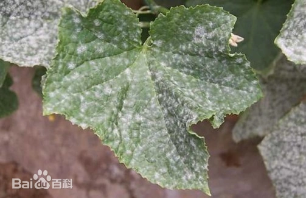
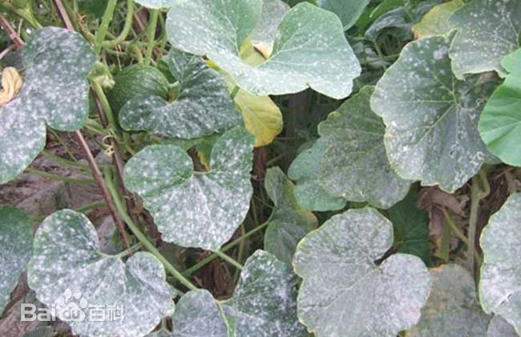
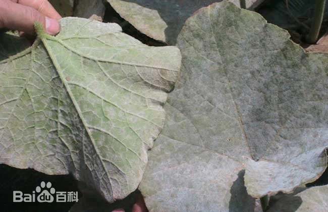

# 南瓜白粉病

|   中文名   | 南瓜白粉病            | 为害作物         | 南瓜                                                         |
| :--------: | --------------------- | ---------------- | ------------------------------------------------------------ |
| **外文名** | Squash powdery mildew | **常见为害部位** | 叶片、叶柄、茎                                               |
| **别  名** |                       | **病  原**       | 瓜类白粉病菌，常见包括 *Podosphaera xanthii* 和 *Golovinomyces cichoracearum* |

## 为害症状

​	南瓜白粉病主要为害叶片，先从植株下部叶片开始发生，发病初始在叶面或叶背产生白色粉状小圆斑，后逐渐扩大为不规则形，边缘不明显的白粉状霉层粉斑，白色粉状物即为病菌的分生孢子梗和分生孢子及无色透明的菌丝体。发生严重时，多个粉斑可连接成片，甚至布满整张叶片。发病叶片的细胞和组织被侵染后并不迅速死亡，将病部粉层抹去，一般只表现为褪绿或变黄。发病中后期白色粉状霉层老熟，呈灰色或灰褐色，上有黑色的小粒点，即病菌的闭囊壳，发病末期病叶组织变为黄褐色而枯死叶柄和茎染病，密生白粉状霉层，霉层连接成片。

|  |  |  |  |
| ------------------------------- | ------------------------------- | ------------------------------- | ------------------------------- |

## 特征

南瓜及其他葫芦科作物的白粉病可由不同白粉菌引起，其中 *Podosphaera xanthii* 是世界多地较常见的病原，*Golovinomyces cichoracearum* 也可引起瓜类白粉病。

病害通常首先在较老叶片上出现白色粉状斑，随后病斑扩大并融合。病叶逐渐褪绿、黄化，严重时叶片变褐、干枯，导致有效光合叶面积下降。

白粉病与许多必须依靠叶面自由水侵染的病害不同；温暖条件、较高空气湿度、冠层郁闭和通风不足均可有利于病害发展。不同地区、栽培方式和病原种之间的适宜条件存在差异。

## 防治方法

### 轻度

1. 发现少量白粉状病斑后，及时摘除明显病叶、老叶和贴地叶片，并带出种植区处理，减少病原菌基数。[01-T1][01-T2]
2. 适当疏除过密叶片，加强棚室或田间通风透光，降低冠层郁闭程度。[01-T1]
3. 合理补充磷、钾肥，维持植株健壮，避免偏施氮肥造成组织柔嫩。[01-T2]
4. 病害刚出现且仍在扩展时，可优先选择**当地登记用于南瓜/瓜类白粉病**的低风险杀菌剂；瓜类和棚室蔬菜技术资料中可见戊唑醇、氟硅唑、乙嘧酚、嘧菌酯以及其他白粉病登记药剂。[01-T2][01-T3]

### 中度

> 适用范围：以下内容仅作为当前确认样本的可选一般指导；不得依据当前样本自动选择治疗层级。涉及药剂时，须由用户确认目标作物并核对当前产品标签及登记适用范围。

1. 清除病斑密集、已明显影响光合作用的叶片，同时尽量保留仍有功能的健康叶片。[01-T1]
2. 调整灌水和通风管理，避免群体长期郁闭，施药时重点保证叶片正反面覆盖。[01-T1]
3. 使用当前登记用于南瓜/瓜类白粉病的杀菌剂进行叶面喷雾，并根据标签规定决定是否需要再次施药。[01-T2][01-T3]
4. 如需连续防治，应轮换不同作用机制药剂，避免长期单一用药导致抗药性上升。[01-T1]
### 重度

> 适用范围：以下内容仅针对当前确认样本及其可见组织；当前样本的重度观察不自动推断大面积、产量、采收期或区域防控。涉及药剂时，须由用户确认目标作物并核对当前产品标签及登记适用范围。

1. 清除已经黄化、枯死并失去光合功能的病叶和病残组织，降低田间病原负荷。
2. 同步加强通风、透光和肥水管理，避免只依赖化学防治。[01-T1][01-T2]
3. 对仍有保产价值的植株，选择登记用于该作物和白粉病的有效药剂规范防治；不得因“重度”自行提高浓度或缩短标签规定的安全间隔。[01-T3]
### 防治措施来源

**[01-T1] A/B**

title: 瓜類病蟲害及防治

site: 台南区农业改良场技术资料

url: https://book.tndais.gov.tw/Magazine/mag10-7.htm

**[01-T2] A**

title: 黑龙江省近期多雨极端天气条件下蔬菜生产指导意见

site: 黑龙江省农业农村厅

url: https://nynct.hlj.gov.cn/nynct/c115394/202406/c00_31745814.shtml

**[01-T3] A**

title: 棚室蔬菜病虫害防治技术

site: 黑龙江省农业农村厅

url: https://nynct.hlj.gov.cn/nynct/c115394/202505/c00_31843153.shtml
