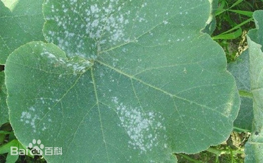

# 南瓜白粉病

|   中文名   | 南瓜白粉病            | 为害作物     | 南瓜       |
| :--------: | --------------------- | ------------ | ---------- |
| **外文名** | Squash powdery mildew | **为害部位** | 叶片       |
| **别  名** |                       | **病  原**   | 瓜类单丝壳 |

## 为害症状

​	南瓜白粉病主要为害叶片，先从植株下部叶片开始发生，发病初始在叶面或叶背产生白色粉状小圆斑，后逐渐扩大为不规则形，边缘不明显的白粉状霉层粉斑，白色粉状物即为病菌的分生孢子梗和分生孢子及无色透明的菌丝体。发生严重时，多个粉斑可连接成片，甚至布满整张叶片。发病叶片的细胞和组织被侵染后并不迅速死亡，将病部粉层抹去，一般只表现为褪绿或变黄。发病中后期白色粉状霉层老熟，呈灰色或灰褐色，上有黑色的小粒点，即病菌的闭囊壳，发病末期病叶组织变为黄褐色而枯死叶柄和茎染病，密生白粉状霉层，霉层连接成片。

|  |  |  |  |
| ------------------------------- | ------------------------------- | ------------------------------- | ------------------------------- |

## 特征

​	中国上海及长江中下游地区南瓜白粉病的主要发病盛期在4月至11月。年度间早春温度偏高、秋季温度偏高的年份发病重；田块间连作地、附近有发病较重的菌源田、排水不良、作物生长势不佳的发病较早较重；栽培上种植过密、通风透光差的、生长势弱、保护地栽培等往往发病较重。处于采收中后期的类型田发病重。

## 防治方法

### 农业防治

1. 加强栽培管理：高畦种植，合理密植，有利于通风透光，同时开好排水沟，降低田间湿度，增强植株生长势，提高抗病力。
2. 保护地栽培管理：要适当控制浇水量，晴天尽量适当开棚通风换气，阴天也应适当短时间开棚换气降湿，中午闷棚升温至35℃，可抑制病害发展，防止引发病害流行。
3. 清洁田园：及时摘除病、老叶，以利通风透光，减少田间菌源。收获后及时清除病残体，带出田外深埋或烧毁，深翻土壤，加速病残体的腐烂分解。

### 化学防治

1. 病害发生前可选用53.8%可杀得2000型1000倍液，或发病初期用10%[世高](https://baike.baidu.com/item/世高/3603499?fromModule=lemma_inlink)1500倍液，或40%福星3000倍液，或72%[普力克](https://baike.baidu.com/item/普力克/10928842?fromModule=lemma_inlink)3000倍液，或12.5%速保利2000倍液，或2%加收米600倍液进行叶面喷雾，隔7-10天喷1次，连续喷2-4次。也可采用小苏打600倍液防治，在个别叶片有1-2个病斑时开始喷雾，每3-4天喷1次，连续喷4-6次。小苏打既能防病害，又能促进生长，且使南瓜产量提高10-20%。喷雾时尽量使用小孔径喷片，以降低叶片表面湿度。
2. 在发病初期开始喷药，每隔7-10天喷1次，连续喷2-3次，重病田视病情发展，必要时可增加喷药次数，并注意药剂的交替使用。
3. 在发病初期开始喷洒25%[乙嘧酚](https://baike.baidu.com/item/乙嘧酚/3670798?fromModule=lemma_inlink)悬浮剂1500-2500倍液，或30%[醚菌酯](https://baike.baidu.com/item/醚菌酯/587462?fromModule=lemma_inlink)悬浮剂1500-2500倍液，或30%氟菌唑可湿性粉剂1500-2000倍液，或10%苯醚甲环唑水分散粒剂1500-2500倍液，或25%三唑酮可湿性粉剂2000倍液，隔7-10天喷1次，连续防治2-3次。
