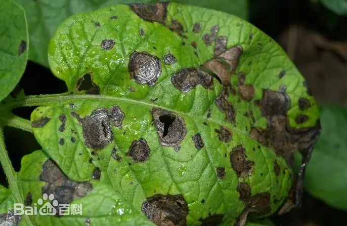
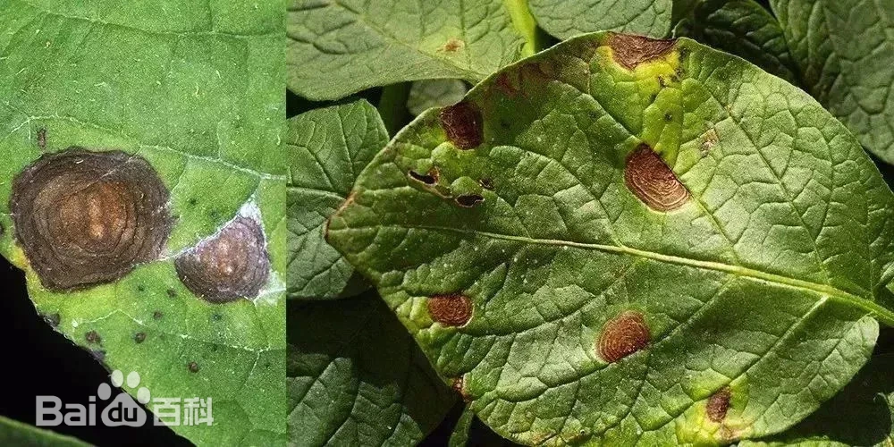
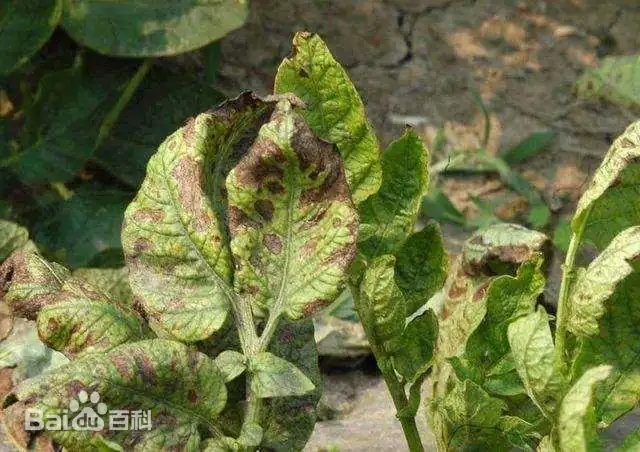

# 马铃薯早疫病

|   中文名   | 马铃薯早疫病           | 为害作物         | 马铃薯                                                       |
| :--------: | ---------------------- | ---------------- | ------------------------------------------------------------ |
| **外文名** | Potato early blight    | **常见为害部位** | 叶片、叶柄、茎和块茎                                         |
| **别  名** | 夏疫病、轮纹病、干斑病 | **病  原**       | 主要病原为茄链格孢 *Alternaria solani*，部分地区还可涉及其他 *Alternaria* spp. |

## 为害症状

​	此病主要为害叶片，也能侵害叶柄、茎和薯块。在叶上病斑最初为褐色圆形斑点，以后逐渐扩大成圆至近圆形，褐色至暗褐色，病斑边缘明显，有清晰的同心轮纹，有时病斑外缘有较窄的黄色晕圈。病斑上可产生少许黑色霉状物。发病多时病斑可连接成不规则大形枯斑，使叶片局部枯死，严重时叶片全部枯死，但仍能看出有轮纹的病斑轮廓，因而易于与其他病害辨认，在茎或叶柄上病斑褐色，线条状，稍凹陷，扩大后呈灰褐色长椭圆形斑，严重时茎、叶可枯死。薯块受害后病斑暗褐色，不规则形，稍凹陷，但只侵害皮下稍许薯肉，呈褐色，干腐状。贮藏后常为其他微生物侵染而腐烂

|  |  |  |  |
| --------------------------------- | --------------------------------- | --------------------------------- | --------------------------------- |

## 特征

> **系统说明：**知识库中的适宜发病条件只作为病害背景知识；系统预设环境信息不能自动作为本次病例“可能诱因”的证据。病例可能诱因仍由既定 Evidence 路径或 Curated Evidence 提供

### 气候条件

分生孢子侵染的温度5～26℃，最适温度12～16℃，而发病的最适温度24～30℃。同时潜育期长短亦与温度有关。25℃时仅2天，10℃和33℃分别延长为8天、7天，35℃以上病害不能发展。分生孢子发芽要求有80％以上湿度，最好有水滴存在，如在适温下仅35～45分钟可发芽，温度低（6℃）或高（34℃）发芽延长至1～2小时，但当相对湿度降低到55％发芽减少，侵染率也低。因此在7～8月雨季温湿度合适时易发病。若这期间雨水多、雾多或露水重，暴风雨次数多发病重。 [3]

### 品种

品种间抗病性有很大差异但无免疫。有很多野生品种具有高抗性，可作为育种材料，如*Solanumbalsii*、*S.curtilobum*、*S.jamesii*、S*.cutarthrum*等。有学者认为马铃薯组织中形成的一种C14萜（Rishitin）和C15萜（Rubimin）的量多少与抗性直接有关。同时发现在苗期抗病品种和感病品种中的含量明显不同，因而可作为抗性定的一种方法。

植株在不同生育期抗病性不同：苗期至孕蕾期抗病性强，始花期开始抗病性减弱，盛期至生长末期抗病性最弱，发病增加。一般早熟种比较容易感病，晚熟种较抗病。

## 防治方法

### 轻度

> 适用范围：以下内容仅作为当前确认样本的可选一般指导；不得依据当前样本自动选择治疗层级。涉及药剂时，须由用户确认目标作物并核对当前产品标签及登记适用范围。

1. 及时处理下部少量严重病叶和病残组织，维持田间通风和健康功能叶。
2. 平衡水肥，避免植株持续处于干旱、缺肥或早衰状态。
3. 加强早疫病巡查，重点观察下部成熟叶片病斑扩展情况。
4. 病害开始扩展时，可使用当前登记的马铃薯早疫病杀菌剂；国家/地方方案列出的有效成分方向包括**苯甲·丙环唑、啶酰菌胺、嘧菌酯、苯甲·嘧菌酯**等。[15-T1][15-T2]
### 中度

> 适用范围：以下内容仅作为当前确认样本的可选一般指导；不得依据当前样本自动选择治疗层级。涉及药剂时，须由用户确认目标作物并核对当前产品标签及登记适用范围。

1. 清除明显失去功能的病叶，重点保护中上部健康叶片。
2. 改善水肥供应，降低植株衰弱造成的感病风险。
3. 根据当前登记标签使用早疫病药剂，2026年技术方案列出的方向包括**苯甲·丙环唑、啶酰菌胺、肟菌·戊唑醇、苯甲·嘧菌酯**等。[15-T1]
4. 轮换不同 FRAC 作用机制，不长期单用同一成分。
### 重度

> 适用范围：以下内容仅针对当前确认样本及其可见组织；当前样本的重度观察不自动推断大面积、产量、采收期或区域防控。涉及药剂时，须由用户确认目标作物并核对当前产品标签及登记适用范围。

1. 重点保护仍健康的功能叶，减少已经枯死的病残组织。
2. 使用当前登记用于马铃薯早疫病的治疗/保护药剂规范防治；不得因重度提高标签剂量。[15-T1]
3. 收获时减少机械损伤，剔除明显病薯并按马铃薯贮藏要求管理。[15-T3]
### 防治措施来源

**[15-T1] A**

title: 2026年马铃薯重大病虫害防控技术方案

site: 南阳市农业农村局

url: https://nyj.nanyang.gov.cn/2026/03-31/1394358.html

**[15-T2] A**

title: 2025年粮食作物重大病虫害防控技术方案

site: 中国农业农村信息网 / 全国农技中心

url: https://www.agri.cn/sc/nszd/202502/t20250228_8758867.htm

**[15-T3] A**

title: 马铃薯贮藏保鲜操作规程

site: 农业农村部农产品冷链物流标准化技术委员会

url: https://scs.moa.gov.cn/ccll/jszn/202302/t20230203_6419765.htm
