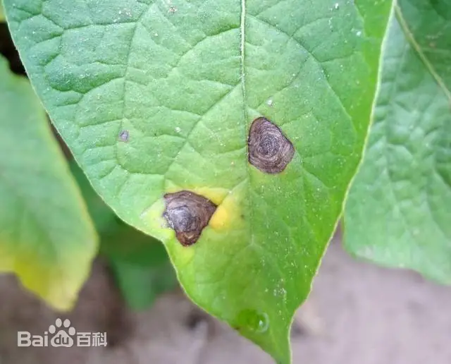

# 马铃薯早疫病

|   中文名   | 马铃薯晚疫病           | 为害作物     | 马铃薯       |
| :--------: | ---------------------- | ------------ | ------------ |
| **外文名** | Potato early blight    | **为害部位** | 茎、叶、块茎 |
| **别  名** | 夏疫病、轮纹病、干斑病 | **病  原**   | 茄链格孢     |

## 为害症状

​	此病主要为害叶片，也能侵害叶柄、茎和薯块。在叶上病斑最初为褐色圆形斑点，以后逐渐扩大成圆至近圆形，褐色至暗褐色，病斑边缘明显，有清晰的同心轮纹，有时病斑外缘有较窄的黄色晕圈。病斑上可产生少许黑色霉状物。发病多时病斑可连接成不规则大形枯斑，使叶片局部枯死，严重时叶片全部枯死，但仍能看出有轮纹的病斑轮廓，因而易于与其他病害辨认，在茎或叶柄上病斑褐色，线条状，稍凹陷，扩大后呈灰褐色长椭圆形斑，严重时茎、叶可枯死。薯块受害后病斑暗褐色，不规则形，稍凹陷，但只侵害皮下稍许薯肉，呈褐色，干腐状。贮藏后常为其他微生物侵染而腐烂

|  |  |  |  |
| --------------------------------- | --------------------------------- | --------------------------------- | --------------------------------- |

## 特征

- ### 气候条件

  分生孢子侵染的温度5～26℃，最适温度12～16℃，而发病的最适温度24～30℃。同时潜育期长短亦与温度有关。25℃时仅2天，10℃和33℃分别延长为8天、7天，35℃以上病害不能发展。分生孢子发芽要求有80％以上湿度，最好有水滴存在，如在适温下仅35～45分钟可发芽，温度低（6℃）或高（34℃）发芽延长至1～2小时，但当相对湿度降低到55％发芽减少，侵染率也低。因此在7～8月雨季温湿度合适时易发病。若这期间雨水多、雾多或露水重，暴风雨次数多发病重。 [3]

  ### 品种

  品种间抗病性有很大差异但无免疫。有很多野生品种具有高抗性，可作为育种材料，如*Solanumbalsii*、*S.curtilobum*、*S.jamesii*、S*.cutarthrum*等。有学者认为马铃薯组织中形成的一种C14萜（Rishitin）和C15萜（Rubimin）的量多少与抗性直接有关。同时发现在苗期抗病品种和感病品种中的含量明显不同，因而可作为抗性定的一种方法。

  植株在不同生育期抗病性不同：苗期至孕蕾期抗病性强，始花期开始抗病性减弱，盛期至生长末期抗病性最弱，发病增加。一般早熟种比较容易感病，晚熟种较抗病。

## 防治方法

### 农业防治

1. 选用早熟抗病品种，特别是应用抗当地几种主要病害的丰产良种。适时提早收获。
2. 加强裁培管理。选择土壤肥沃的高燥田块种植，增施有机肥，提高寄主抗病能力是防治此病的主要栽培措施。加强管理，增施钾肥，及时灌溉，促进植株生长壮。清除田间病残体，减少初侵染来源。
3. 合理储运。收获充分成熟的薯块，尽量减少收获和运输中的损伤，病薯不入窖，储藏温度以4℃为宜，并且通风换气。
4. 深翻地减少初侵染源。裁种时剔除病薯，不让病薯混入播种材料中。
5. 不要和[茄科](https://baike.baidu.com/item/茄科/8596319?fromModule=lemma_inlink)作物[轮作](https://baike.baidu.com/item/轮作/2940149?fromModule=lemma_inlink)或邻作。

### 化学防治

​	发病前可用25%阿米西达1500～2000倍液或70%代森锰锌可湿性粉剂600～800倍液交替喷施预防，7～10天喷施1次，连续预防2～3次。发病后用50%速克灵可湿性粉剂800～1000倍液、70%代森锰锌可湿性粉剂600～800倍液、50%扑海因可湿性粉剂1000～1500倍液、70%甲基托布津可湿性粉剂800倍液、72%霜脲·锰锌600～800倍液喷雾，为防止产生抗药性，提高防效，上述药剂交替轮换使用，7天1次，视情况连喷2～3次。
