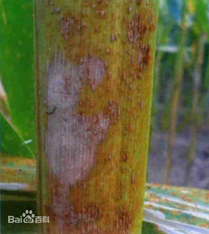

# 玉米锈病

|   中文名   | 玉米锈病  | 为害作物         | 玉米                                                         |
| :--------: | --------- | ---------------- | ------------------------------------------------------------ |
| **外文名** | Corn rust | **常见为害部位** | 叶片、叶鞘等地上部组织                                       |
| **别  名** |           | **病  原**       | 柄锈菌属 *Puccinia* spp.；常见包括普通锈病菌 *Puccinia sorghi* 和南方锈病菌 *Puccinia polysora* |

## 为害症状

玉米锈病主要在叶片形成具有铁锈色粉状孢子的疱斑，严重时可造成叶片黄化、坏死并降低有效光合面积。

**普通锈病**的疱斑通常呈肉桂褐色至深褐色，形状可为椭圆形或长椭圆形，常同时出现在叶片正面和背面，也可侵染叶鞘。

**南方锈病**的疱斑通常较小，颜色偏橙黄至浅褐色，往往在叶片正面更加集中。在温暖、高湿条件下，南方锈病具有较快扩展和造成严重损失的潜力。

当仅凭用户上传图片不能可靠区分普通锈病与南方锈病时，本系统保持输出“玉米锈病”，不进一步推断具体病原种

| 图1 | 图2 | 图3 | 图4 |
| -------------------------------- | -------------------------------- | -------------------------------- | -------------------------------- |

## 特征

玉米普通锈病和南方锈病是两个不同的病害实体。

- **普通锈病（Common rust）**
  - 病原：*Puccinia sorghi*
  - 较适合凉爽、潮湿环境。
  - 疱斑常可同时出现在叶片上下表面。

- **南方锈病（Southern rust）**
  - 病原：*Puccinia polysora*
  - 通常更偏好温暖、高湿环境。
  - 在适宜条件下扩展速度和潜在危害通常高于普通锈病。

因此知识库的防治措施不能把“南方锈病的专门方案”无条件解释为所有玉米锈病的固定处方。具体用药仍需结合实际病害类型和当前农药登记标签。

## 防治方法

### 轻度

> 适用范围：以下内容仅作为当前确认样本的可选一般指导；不得依据当前样本自动选择治疗层级。涉及药剂时，须由用户确认目标作物并核对当前产品标签及登记适用范围。

1. 合理密植，保持田间通风；科学施肥，避免偏施氮肥，适当补充磷钾肥。[04-T1][04-T2]
2. 雨后及时排水，降低田间长期高湿环境。[04-T1][04-T2]
3. 持续观察病斑是否向中上部功能叶扩展。
4. 发病初期如需要药剂保护，可选择当地登记用于玉米锈病的**苯醚甲环唑、吡唑醚菌酯、戊唑醇、丙环·嘧菌酯等**相应产品，并严格按标签使用。[04-T1][04-T2]
### 中度

> 适用范围：以下内容仅作为当前确认样本的可选一般指导；不得依据当前样本自动选择治疗层级。涉及药剂时，须由用户确认目标作物并核对当前产品标签及登记适用范围。

1. 对病害持续扩展的田块加强监测，重点保护中上部功能叶和灌浆期叶片。
2. 依据当前登记标签选用三唑类、甲氧基丙烯酸酯类或复配杀菌剂；南方锈病官方方案列出的有效成分方向包括吡唑醚菌酯、戊唑醇、氟环唑、嘧菌酯等及其复配剂。[04-T2]
3. 根据病情、天气和产品标签判断是否需要第二次施药，不统一规定所有产品固定间隔。[04-T2]
4. 轮换不同作用机制药剂，避免长期单一使用。
### 重度

1. 大范围锈病发生时实施统一监测和区域防治，重点保护仍有产量贡献的功能叶。
2. 已确认南方锈病且仍处于具有保产价值的阶段时，可按当地植保指导使用登记药剂开展统防统治。[04-T2]
3. 不因严重程度提高药剂浓度；作业时做好个人防护，并遵守环境风速、安全间隔和标签技术要求。[04-T2]
4. 病害已发生在灌浆后期时，应结合剩余生育期评估继续施药的经济性。

### 防治措施来源

**[04-T1] A**

title: 合川区植保植检信息 第五期

site: 重庆市合川区人民政府 / 区农业农村委

url: https://www.hc.gov.cn/bmjd/bm_100475/nyncw/zwxx_101376/dt_101378/202606/t20260609_15740893.html

**[04-T2] A**

title: 玉米南方锈病防控技术指导意见

site: 济南市农业农村局

url: https://jnny.jinan.gov.cn/col562/art/2024/art_562_4787817.html

## R3.1 严重度证据

本轻/中/重规则为基于可靠农业资料整理形成的系统辅助判定规则，并非宣称原始资料本身采用相同三级分级。

### 轻度

- 状态：COMPLETE；玉米叶片出现褪绿小斑点或少量早期疱斑。
- 可观察特征：褪绿小斑点；少量早期疱斑。
- 证据类型：EVIDENCE_SYNTHESIZED；来源：[R31-PLANT-04-SYM]。
- 证据整理说明：evidence_synthesized：灵寿县植保情报直接描述南方锈病由褪绿小斑开始。

### 中度

- 状态：COMPLETE；小斑点发展为黄褐色突起疱斑，表皮破裂并散出铁锈色粉状物。
- 可观察特征：黄褐色突起疱斑；表皮破裂；铁锈色粉状物。
- 证据类型：EVIDENCE_SYNTHESIZED；来源：[R31-PLANT-04-SYM]。
- 证据整理说明：evidence_synthesized：依据来源中的疱斑成熟、破裂和散粉进展整理；来源量化损失不复制。

### 重度

- 状态：COMPLETE；叶片被孢子堆广泛覆盖并干枯死亡，植株光合功能明显受损。
- 可观察特征：孢子堆广泛覆盖；叶片干枯死亡；光合功能受损。
- 证据类型：EVIDENCE_SYNTHESIZED；来源：[R31-PLANT-04-SYM]。
- 证据整理说明：evidence_synthesized：来源直接记录大发生时叶片被孢子堆覆盖并干枯死亡；不引用来源中的产量百分比。
