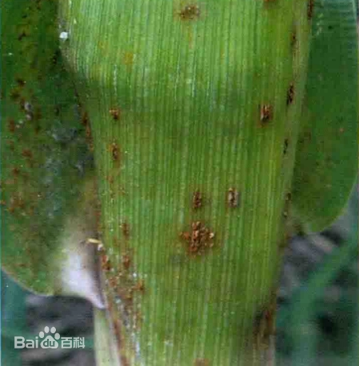
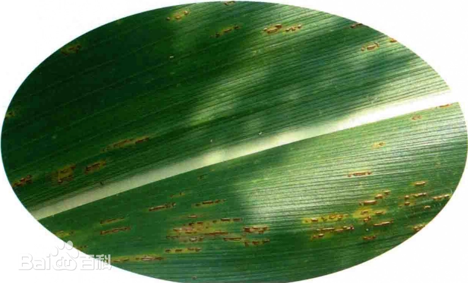
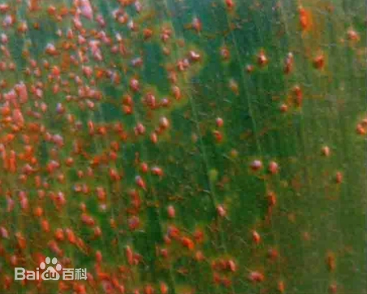

# 玉米锈病

|   中文名   | 玉米锈病  | 为害作物     | 玉米                   |
| :--------: | --------- | ------------ | ---------------------- |
| **外文名** | corn rust | **为害部位** | 叶片、叶鞘、茎秆、苞叶 |
| **别  名** |           | **病  原**   | 玉米柄锈菌             |

## 为害症状

​	玉米锈病主要发生在玉米叶片上，也能够侵染[叶鞘](https://baike.baidu.com/item/叶鞘/8533526?fromModule=lemma_inlink)（图1）、茎秆（图2）和[苞叶](https://baike.baidu.com/item/苞叶/9945006?fromModule=lemma_inlink)。侵染初期，叶片两面初生淡黄白色小斑，四周有黄色晕圈（图3），后突起形成黄褐色乃至红褐色疱斑，散生或聚生圆形或长圆形，即病菌的夏孢子堆（图4）。孢子堆表皮破裂后，散出铁锈状夏孢子（图5）。后期病斑或其附近又出现黑色疱斑，即病菌的冬孢子堆，长椭圆形，疱斑破裂散出黑褐色粉状物。

​	发病严重时，整张叶片可布满锈褐色病斑，引起叶片枯黄，同时可危害苞叶、[果穗](https://baike.baidu.com/item/果穗/11056978?fromModule=lemma_inlink)和[雄花](https://baike.baidu.com/item/雄花/2928525?fromModule=lemma_inlink)。

| 图1 | 图2 | 图3 | 图4 |
| -------------------------------- | -------------------------------- | -------------------------------- | -------------------------------- |

## 特征

​	玉米柄锈菌喜温暖潮湿的环境，发病温度范围15-35℃；最适发病环境温度为20-30℃，相对湿度95%以上；最适感病生育期为开花结穗到采收中后期。夏孢子在侵入时需高湿，叶面结露，适宜于夏孢子形成和侵入。中国[上海](https://baike.baidu.com/item/上海/114606?fromModule=lemma_inlink)及[长江中下游地区](https://baike.baidu.com/item/长江中下游地区/5922774?fromModule=lemma_inlink)玉米锈病的主要发病盛期在5-10月年度间夏秋高温、多湿及多连阴雨的年份发病重。田块间连作地排水不良的田块发病较重。栽培上种植早熟品种、密度过高、通风透光差、偏施氮肥的田块发病重。

## 防治方法

### 农业防治

1. **品种选择：**选育耐病品种，种植中、晚熟品种。
2. **茬口轮作：**与其他非[豆科](https://baike.baidu.com/item/豆科/3672199?fromModule=lemma_inlink)作物实行2年以上[轮作](https://baike.baidu.com/item/轮作/2940149?fromModule=lemma_inlink)。
3. **清洁田园：**收获后及时清除田间病残体，带出地外集中烧毁或深埋，深翻土壤，减少土表越冬病菌。
4. **加强田间管理：**深沟高畦栽培，合理密植，科学施肥，增施有机肥和磷钾肥，及时整枝，开好排水沟系，使雨后及时排水。

### 化学防治

在发病初期开始喷药，每隔7-10天喷1次，连续喷1-2次。

- **绿色防治用药：**可选用20%[苯醚甲环唑](https://baike.baidu.com/item/苯醚甲环唑/587199?fromModule=lemma_inlink)微乳剂（捷菌）1500-2000倍液（每亩用量30-60克）；30%[氟硅唑](https://baike.baidu.com/item/氟硅唑/10844625?fromModule=lemma_inlink)微乳剂（世飞）300-5000倍液（每亩用量12-15克）；40%氟硅唑（福星）乳油6000-8000倍液（每亩用量7.5-10克）；18%戊唑醇微乳剂（安盈）1000-2000倍液（每亩用量50-100克）；10%苯醚甲环唑水分散粒剂（世高）800-1200倍液（每亩用量50-75克）；43%[戊唑醇](https://baike.baidu.com/item/戊唑醇/2336214?fromModule=lemma_inlink)悬浮剂（好力克）3000-4000倍液（每亩用量15-20克）；75%肟菌·戊唑醇水分散剂（拿敌稳）3000倍液（每亩用量25-35克）等喷雾防治。
- **常规防治用药：**80%[代森锰锌](https://baike.baidu.com/item/代森锰锌/5859635?fromModule=lemma_inlink)可湿性粉剂（山德生）600-800倍液（每亩用量75-100克）等喷雾防治。
