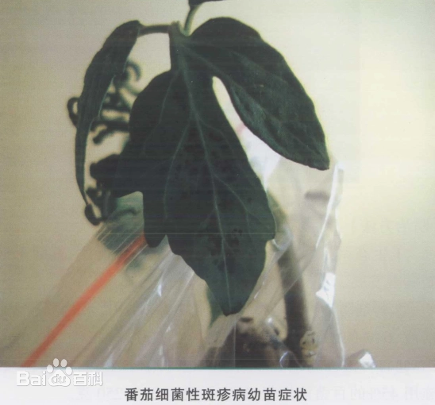
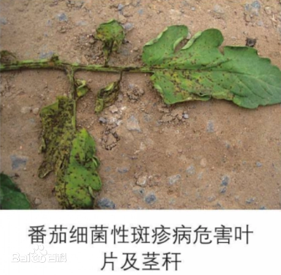
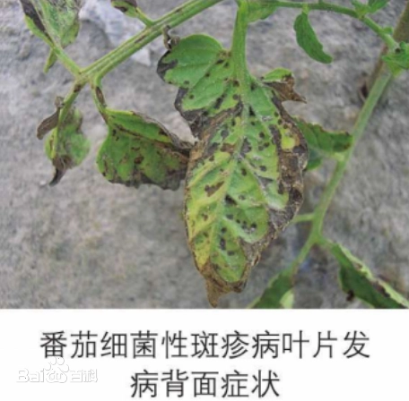
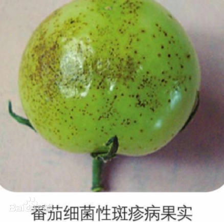

# 番茄细菌性斑点病

> **实体说明：**系统现有识别类别名保持“番茄细菌性斑点病”；本知识库依据现有病原和症状证据，按 **番茄细菌性斑疹病（Tomato bacterial speck）** 维护，不与 *Xanthomonas* spp. 引起的 tomato bacterial spot 混用。

|   中文名   | 番茄细菌性斑点病（知识库实体：番茄细菌性斑疹病） | 为害作物         | 番茄                                                         |
| :--------: | ------------------------------------------------ | ---------------- | ------------------------------------------------------------ |
| **外文名** | Tomato bacterial speck                           | **常见为害部位** | 叶片、茎、叶柄、花和果实                                     |
| **别  名** | 番茄细菌性斑疹病、细菌性微斑病                   | **病  原**       | 丁香假单胞菌番茄致病变种 *Pseudomonas syringae* pv. *tomato* |

## 为害症状

番茄细菌性斑疹病可在苗期和成株期发生，主要侵染叶片、茎、叶柄、花和果实。

- **叶片：**形成小型深褐色至黑色斑点，周围常出现黄色或黄绿色晕圈；病斑较多时可融合并造成叶缘坏死。
- **茎和叶柄：**可出现深色小斑点或坏死斑。
- **果实：**未成熟果实可出现细小、表浅、略隆起的黑色斑点，病斑通常较小，主要影响外观和商品性。
- 严重发生时，植株可出现明显叶片坏死和生长受抑，影响果实成熟和产量。

本病与 tomato bacterial spot 症状相似，但二者不是同一病害：

- **Bacterial speck：**主要病原为 *Pseudomonas syringae* pv. *tomato*，较偏好凉爽、潮湿条件。
- **Bacterial spot：**由 *Xanthomonas* 类群细菌引起，通常更适合温暖、潮湿条件，果实斑点往往更大、更明显呈疮痂状。

|  |  |  |  |
| ------------------------------------- | ------------------------------------- | ------------------------------------- | ------------------------------------- |

## 特征

病菌可随带菌种子、病残体或带菌种苗传播，也可借助降雨、喷灌形成的水滴飞溅以及受污染的农事操作传播。

番茄细菌性斑疹病通常在凉爽和潮湿条件下发展较快。持续高温会抑制 bacterial speck 的发展，因此不能把所有“番茄细菌性斑点类病害”都使用同一套温度条件解释。

## 防治方法

### 轻度

1. 摘除少量严重病叶，农事操作后清洁工具；避免在植株带露水或叶面潮湿时整枝、打杈。[07-T1]
2. 将喷灌改为沟灌、滴灌等减少水滴飞溅的灌溉方式。[07-T1]
3. 加强棚室通风，减少凉湿条件下叶面持续湿润。
4. 若需要保护性药剂，可使用**当地登记用于番茄及目标细菌病害**的铜制剂或其他细菌病药剂；UC IPM 对 bacterial speck 的管理证据支持铜制剂作为保护性措施，但中国实际使用必须核对本地登记。[07-T1]

### 中度

> 适用范围：以下内容仅作为当前确认样本的可选一般指导；不得依据当前样本自动选择治疗层级。涉及药剂时，须由用户确认目标作物并核对当前产品标签及登记适用范围。

1. 加强病叶清理、灌溉管理和操作分区，避免人员、工具和水滴把病菌从病区带到健康区。
2. 北京设施蔬菜技术资料中，番茄细菌性病害可选用**春雷素·多粘菌、噻森铜**等登记药剂方向；是否适用于当前 P. syringae pv. tomato 必须以当前登记标签为准。[07-T2]
3. 铜制剂只能提供部分保护作用，且可能存在铜抗性，不应把单一铜制剂视为“治愈性”方案。[07-T1]
4. 按标签轮换药剂并严格执行安全间隔。
### 重度

> 适用范围：以下内容仅针对当前确认样本及其可见组织；当前样本的重度观察不自动推断大面积、产量、采收期或区域防控。涉及药剂时，须由用户确认目标作物并核对当前产品标签及登记适用范围。

1. 对严重受害植株及时清除并带出生产区。
2. 严格实行病区与健康区操作分离，工具消毒、减少喷灌和雨滴飞溅。
3. 药剂只使用当前登记用于番茄相应细菌病害的产品，不采用高频、高浓度或未经登记的混配方案。[07-T2]
### 防治措施来源

**[07-T1] B（实体直接对应 bacterial speck）**

title: Bacterial Speck / Tomato / Agriculture: Pest Management Guidelines

site: UC Statewide IPM Program

url: https://ipm.ucanr.edu/agriculture/tomato/bacterial-speck/

**[07-T2] A**

title: 冬季设施蔬菜主要病虫害综合防控技术指导意见

site: 北京市农业农村局

url: https://nyncj.beijing.gov.cn/nyj/zwgk/ztgk/zwbhxx/543453437/index.html
