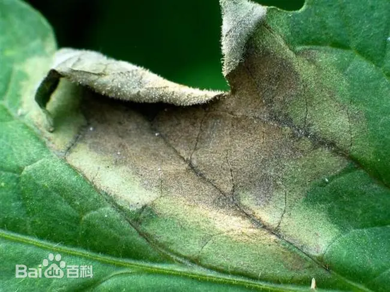
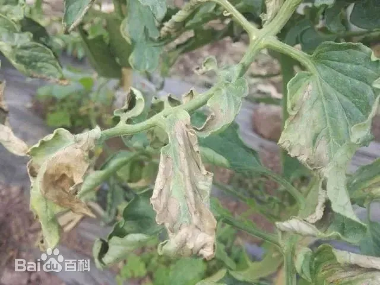
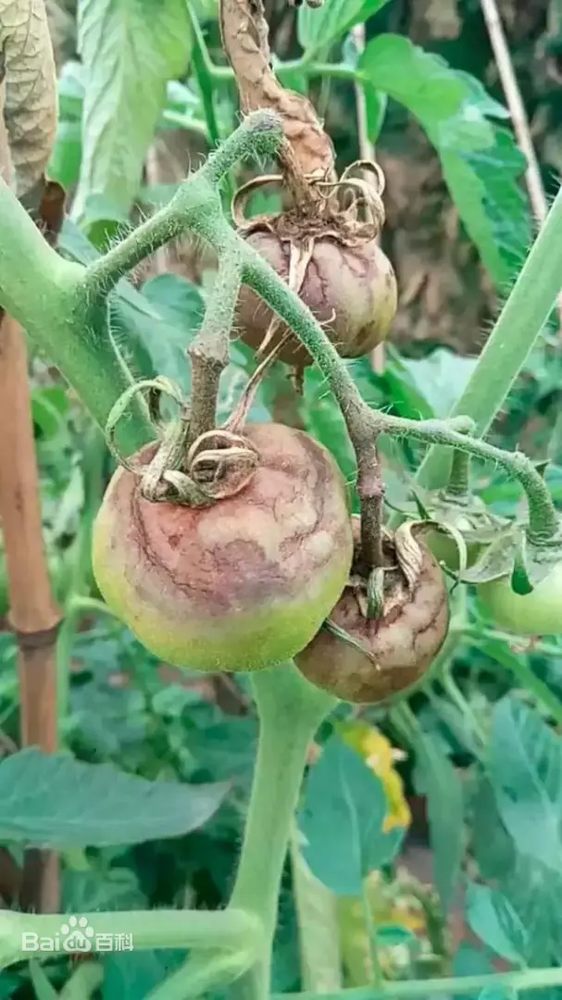
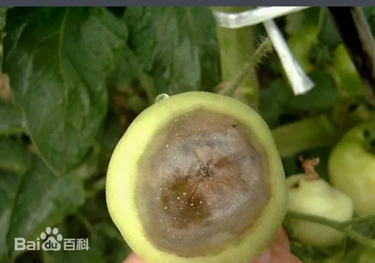

# 番茄晚疫病

|   中文名   | 番茄晚疫病         | 为害作物         | 番茄                              |
| :--------: | ------------------ | ---------------- | --------------------------------- |
| **外文名** | Tomato late blight | **常见为害部位** | 叶片、叶柄、茎、果实              |
| **别  名** | 番茄疫病           | **病  原**       | 致病疫霉 *Phytophthora infestans* |

## 为害症状

​	番茄晚疫病在番茄的整个生育期均可发生，幼苗、叶、茎、果实均可发病。

​	**幼苗发病**：初期叶片产生暗绿色水浸状病斑，并逐渐向主茎蔓延，使茎基部变细，呈水渍状缢缩，最后整株萎蔫或折倒，湿度大时病部表面着生白色霉层。

​	**叶片发病**：多从植株中下部叶尖或叶缘开始，逐渐向上部叶片和果实蔓延，初期为暗绿色，不规则水渍状病斑，病健交界处无明显界限。空气湿度较大时，病斑会迅速扩展，叶背边缘可见一层白色霉层。空气干燥时病斑呈浅褐色，继而变为暗褐色后干枯。

​	**茎秆发病：**茎秆发病，初呈水渍状，渐呈暗褐色或黑褐色腐败状，病茎部组织变软，水分供应受阻，严重的病部折断，植株萎蔫。

​	**果实发病**：多从青果近果柄处发病，病斑呈不明显的油渍状大斑，逐渐向四周发展呈云状不规则斑，病斑边缘没有明显界限，后期逐渐变为深褐色（好像铁锈），病斑稍凹陷，病果质硬不软腐，周缘不变红，潮湿时病斑表面产生一层白色霉状物，发病严重时果实病部出现条状裂纹

|  |  |  |  |
| ------------------------------- | ------------------------------- | ------------------------------- | ------------------------------- |

## 特征

番茄晚疫病由致病疫霉（*Phytophthora infestans*）引起。该病原属于卵菌类病原，并非真正意义上的真菌。

病害偏好凉爽、潮湿环境。叶片常先出现不规则水渍状病斑，随后转为橄榄褐色或褐色；在高湿条件下，病斑边缘或叶背可出现白色霉状病原结构。茎、叶柄和果实也可受侵染。

适宜的凉湿条件下病害可以迅速扩展；持续高温、干燥环境会抑制病害发展。病原可通过带病种苗、带病薯块或空气传播的孢子等方式进入生产区域。

因此，知识库中的环境条件只能作为病害发生风险背景，不能把固定的系统预设温湿度直接解释成本次病例已经被证明的发病原因。

## 防治方法

### 轻度

> 适用范围：以下内容仅作为当前确认样本的可选一般指导；不得依据当前样本自动选择治疗层级。涉及药剂时，须由用户确认目标作物并核对当前产品标签及登记适用范围。

1. 发现中心病株或典型病叶后及时复核并清除严重病组织，降低初始侵染源。
2. 加强棚室通风、清沟排水，尽量避免喷灌和叶面长时间潮湿。
3. 关注连续阴雨、低温高湿等晚疫病高风险天气。
4. 在预警或发病初期，可按当前登记标签选用**烯酰吗啉、氰霜唑、氟菌·霜霉威**等晚疫病药剂方向。[06-T1][06-T2]
### 中度

> 适用范围：以下内容仅作为当前确认样本的可选一般指导；不得依据当前样本自动选择治疗层级。涉及药剂时，须由用户确认目标作物并核对当前产品标签及登记适用范围。

1. 多点发生后加强病株处理和健康叶片保护，减少田间二次传播。
2. 根据当地预警和当前登记标签，可选择嘧菌酯、霜霉·嘧菌酯、嘧菌·百菌清等登记药剂，或使用当地登记的其他保护性/治疗性杀菌剂。[06-T2]
3. 农业农村部技术指导曾给出 50%烯酰吗啉水分散粒剂、10%氰霜唑悬浮剂、68.75%氟菌·霜霉威悬浮剂等喷雾示例；实际必须以当前购买产品标签为准。[06-T1]
4. 轮换作用机制，避免连续单一用药。
### 重度

> 适用范围：以下内容仅针对当前确认样本及其可见组织；当前样本的重度观察不自动推断大面积、产量、采收期或区域防控。涉及药剂时，须由用户确认目标作物并核对当前产品标签及登记适用范围。

1. 及时清除严重病株、病果和坏死组织，防止持续产生侵染源。
2. 使用当地登记的晚疫病治疗性和保护性药剂组合管理，但所有剂量、次数、安全间隔均服从标签。[06-T1][06-T2]
### 防治措施来源

**[06-T1] A**

title: 园艺作物应对高温暴雨洪涝生产技术指导意见

site: 农业农村部种植业管理司

url: https://zzys.moa.gov.cn/gdxw/202007/t20200710_6348404.htm

**[06-T2] A**

title: 2025年园艺作物重大病虫害防控技术方案

site: 中国农业农村信息网 / 全国农技中心

url: https://www.agri.cn/sc/nszd/202502/t20250228_8758865.htm

## R3.1 严重度证据

本轻/中/重规则为基于可靠农业资料整理形成的系统辅助判定规则，并非宣称原始资料本身采用相同三级分级。

### 轻度

- 状态：COMPLETE；番茄叶片出现小的水浸状区域，局部呈油状斑。
- 可观察特征：小水浸状区域；局部油状斑。
- 证据类型：EVIDENCE_SYNTHESIZED；来源：[R31-PLANT-06-SYM]。
- 证据整理说明：evidence_synthesized：来源直接描述晚疫病叶片从小水浸状区域开始。

### 中度

- 状态：COMPLETE；斑块迅速扩大为紫褐色油状病斑，叶背可见灰白色霉层，并向叶柄和嫩茎扩展。
- 可观察特征：紫褐色油状斑；灰白色霉层；向叶柄/嫩茎扩展。
- 证据类型：EVIDENCE_SYNTHESIZED；来源：[R31-PLANT-06-SYM]。
- 证据整理说明：evidence_synthesized：按照来源的病斑扩大、产孢及向叶柄/嫩茎扩展整理。

### 重度

- 状态：COMPLETE；整片叶片死亡，病害快速扩展到叶柄和嫩茎，果实出现明显褐变病斑。
- 可观察特征：整叶死亡；叶柄/嫩茎受害；果实褐变病斑。
- 证据类型：EVIDENCE_SYNTHESIZED；来源：[R31-PLANT-06-SYM]。
- 证据整理说明：evidence_synthesized：来源明确记录整叶死亡、快速扩展到茎部和果实褐变；不外推未给出的面积比例。
