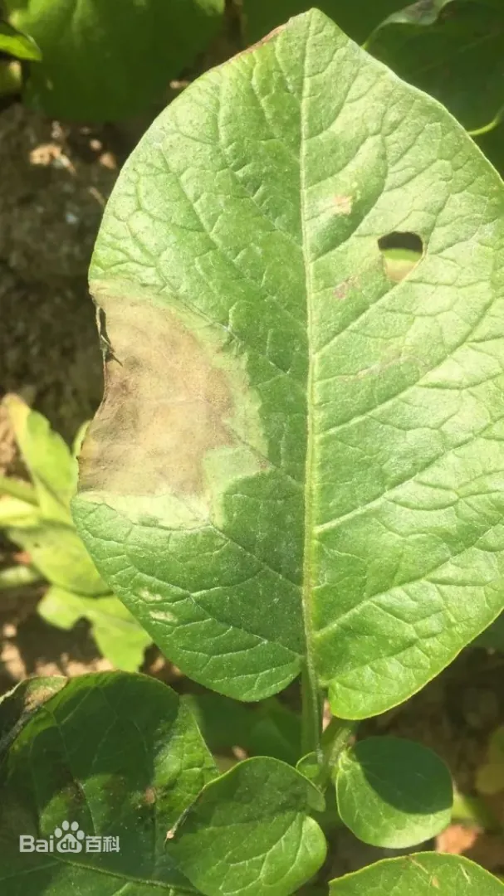
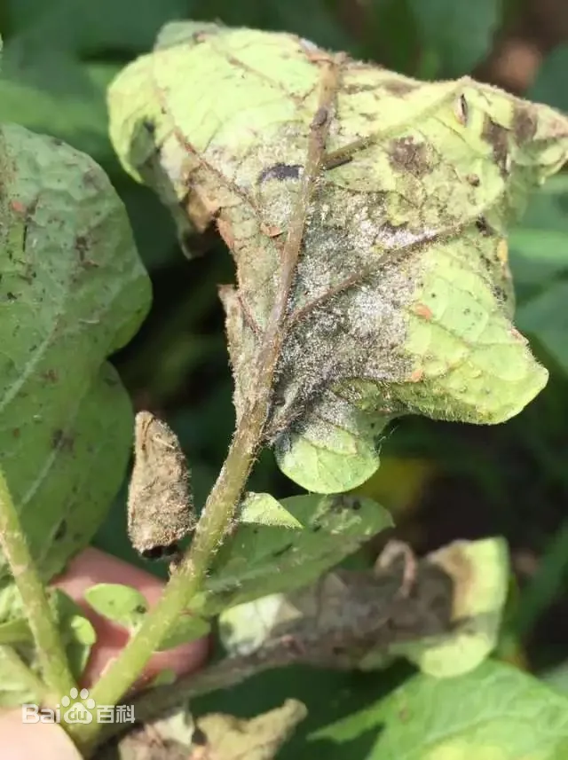

# 马铃薯晚疫病

|   中文名   | 马铃薯晚疫病       | 为害作物     | 马铃薯                   |
| :--------: | ------------------ | ------------ | ------------------------ |
| **外文名** | Potato late blight | **为害部位** | 茎、叶、块茎、花蕾、浆果 |
| **别  名** |                    | **病  原**   | 致病疫霉                 |

## 为害症状

​	晚疫病发生在马铃薯的叶、茎和薯块上。叶片发病，起初造成形状不规则的黄褐色斑点，没有整齐的界限。气候潮湿时，病斑迅速扩大，其边缘呈水渍状，有一圈白色霉状物，在叶的背面，长有茂密的白霉，形成霉轮，这是马铃薯晚疫病的特征。在干燥时，病斑停止扩展，病部变褐变脆，病斑边缘亦不产生白霉。诊断方法，可取带有病斑的叶子，把叶柄插在碗内的湿沙里，上盖一空碗以保润。如果是晚疫病，经一夜就会在病斑的边缘上出现白霉，挑出少许白霉用显微镜观察鉴定。

​	茎部受害，初呈稍凹陷的褐色条斑。气候潮湿时，表面也产生白霉，但不及叶片上的繁茂。薯块受害发病初期产生小的褐色或带紫色的病斑，稍凹陷，在皮下呈红褐色，逐渐向周围和内部发展。土壤干燥时病部发硬，呈干腐状；而在粘重多湿的土壤内，常有杂菌从病斑侵入繁殖，造成薯块软腐。在贮藏中的带病薯块，由于窖内温湿度的影响和杂菌的侵染，也可能转为干腐和湿腐

|  |  |  |  |
| --------------------------------- | --------------------------------- | --------------------------------- | --------------------------------- |

## 特征

- **气象因素**

病害的发生与流行，与气候条件和马铃薯的生育阶段都有密切的关系。一般空气潮、暖而阴沉的天气，早晚露重，加以经常阴雨的情况下，最易发病。中国大部分马铃薯栽培地区的温度，都适于晚疫病发生，因此，湿度对病害发生起决定的作用。如雨水少，空气度不足，病害就可能不发生或者发生轻微，而相对度在75％以上的潮温气候发病重。在中国华北、西北及东北等地区，马铃薯多春播秋收，7月份的雨量影响病害很大，如雨季来得早，雨量又多，病害就发生得早而重。长江流域各省，一年栽两季，在第一季正遇梅雨，病害常严重发生。

根据气候特点和马铃薯的生育阶段与病害的关系，可以预测发病情况。在中心病株出现后，病害的蔓延速度，主要取决于当地的气候条件和品种抗病力的强弱。根据各地观察，在温湿度适于病害发展和种植感病品种的条件下，大约经过10-14天，才可以传播到全田的每个植株。 [1]

- **品种因素**

不同品种对晚疫病的抗病力有很大差异，病害流行程度取决于品种的抗病性强弱。一般叶片平滑宽大、表面气孔数目多，叶色黄绿，匍匐型的品种，容易感病，叶片小而茸毛多，叶肉厚，颜色深绿的直立型品种，比较抗病。病菌在感病品种上产生孢子囊的数量大，发病时间早，蔓延传播快，易暴发成灾。寄主在田间以芽期最易感病，后抗病力逐渐增强，到现蕾期抗病力又下降，开花期感病最重，病害流行也多从开花期开始。 [5]

- **栽培管理因素**

晚疫病的发生与田间管理水平有很大关系，地势低洼、排水不良的田块，发病较重；土壤瘠薄缺氧或黏重土壤，使植株生长衰弱，有利于病害发生；过分密植或株型高大，可增加田间小气候湿度，有利于发病；偏施氮肥引起植株徒长，有利于发病，增施钾肥可提高植株抗病性减轻病害发生；旱地比水旱轮作稻田发病，连作田块（与番茄等茄科作物轮作地块）比轮作田块发病重。

## 防治方法

### 农业防治

**选用抗病品种**

不同的马铃薯品种对晚疫病的抗病力有很大差异，可以推广抗病品种以有效减轻晚疫病的威胁。虽然抗病品种是防治马铃薯晚疫病的最根本措施，但由于品种抗性受其自身遗传变异以及外界因子的影响而不断发生变化，许多抗病能力强的品种经多年种植，抗性可能会减弱甚至完全丧失，从而导致晚疫病的流行发生和产量损失。

- **减少菌源**

选用无病种薯减少初侵染源。留种田除严格进行化学保护外，还应增高培土，注意排水，防止病菌随雨水渗人土中侵染新薯。在秋收入窖、冬藏查窖、出窖、切块、春化等过程中，每次都要严格剔除病薯，有条件的要建立无病留种地，进行无病留种。要选择已过休眠期薯皮光滑细嫩、芽眼深浅一致健康无病、无破损、大小均匀一致、储藏良好、品种特征明显的薯块作为种薯推广小整薯（15-50克）播种技术，避免切刀传病。减少初侵染源。做到秋收入窖、冬藏查窖、出窖、切块、春化等过程中，每次都要严格剔除病薯，有条件的要建立无病留种地，进行无病留种。

- **合理轮作**

在推广种植优良感病品种时，要选择3年以上轮作的田块，最好不要在马铃薯晚疫病的常发区种植。避免与茄科类、十字花科类作物连作或套种，特别是严禁与番茄连作。

- **加强田间管理**

选土质疏松、排水良好的田块栽植，促进植株健壮生长，增强抗病力，开花前后加强田间调查，一旦发现中心病株，立即拔除，并摘除附近植株上的病叶，就地深埋，撤上石灰。

### 化学防治

​	根据气象条件和发病中心的出现进行晚疫病流行的预测预报，及时对发病中心附近及低洼地进行化学防治，逐步扩大防治范围。喷药次数因药剂种类和气象条件而定。由于没有高抗晚疫病的品种，在晚疫病流行时，化学防治是控制马铃薯晚疫病流行的主要措施。在晚疫病发生初期，要及时清除病株，并进行第一次喷药，以后根据具体情况，7-10天喷药一次，一连喷2次。药剂可选择58％[甲霜灵锰锌](https://baike.baidu.com/item/甲霜灵锰锌/12605686?fromModule=lemma_inlink)、64％[杀毒矾](https://baike.baidu.com/item/杀毒矾/7005260?fromModule=lemma_inlink)、[代森锰锌](https://baike.baidu.com/item/代森锰锌/5859635?fromModule=lemma_inlink)（大生M-45）、72％克露或69％安克锰锌等。为防止病菌产生抗药性，最好不同类型药剂交替使用
