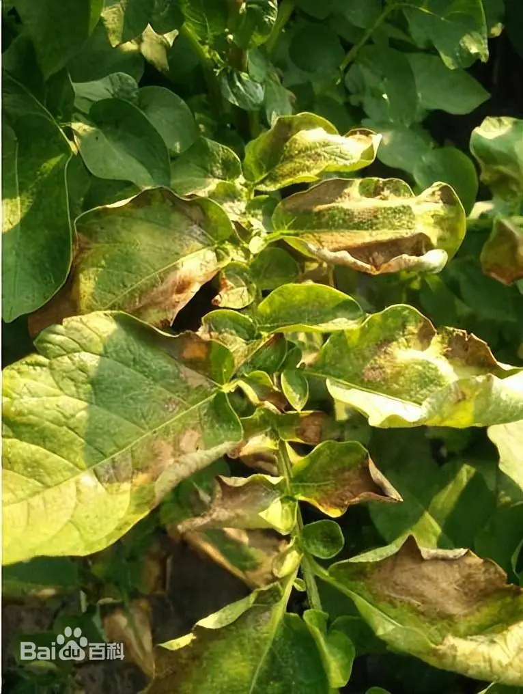
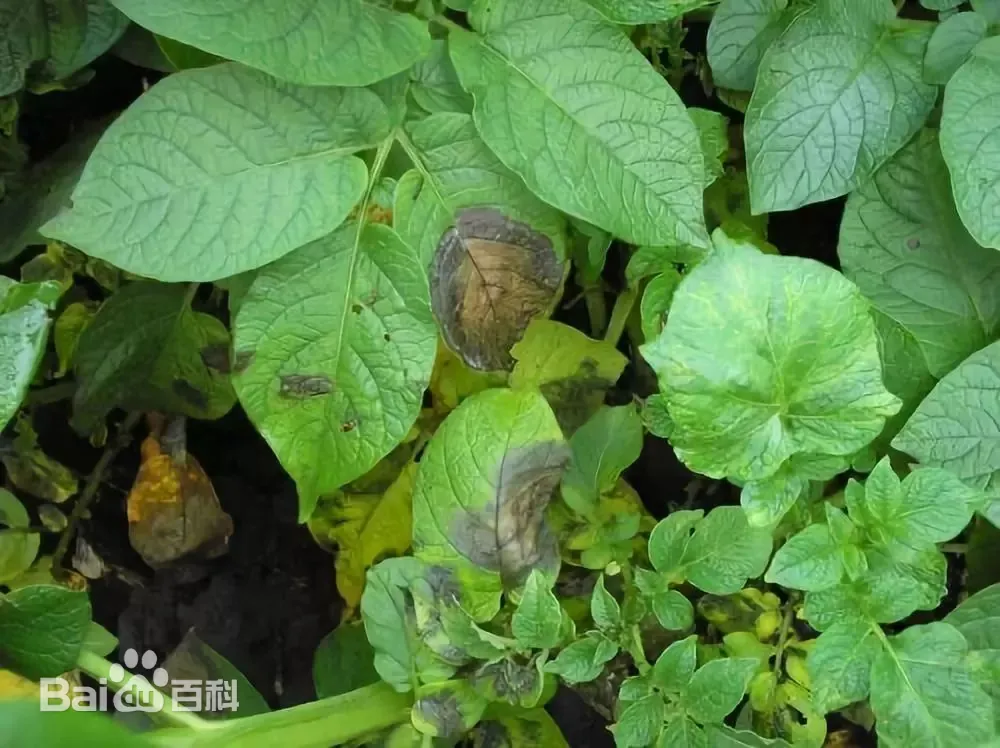

# 马铃薯晚疫病

|   中文名   | 马铃薯晚疫病       | 为害作物         | 马铃薯                            |
| :--------: | ------------------ | ---------------- | --------------------------------- |
| **外文名** | Potato late blight | **常见为害部位** | 叶片、叶柄、茎和块茎              |
| **别  名** |                    | **病  原**       | 致病疫霉 *Phytophthora infestans* |

## 为害症状

​	晚疫病发生在马铃薯的叶、茎和薯块上。叶片发病，起初造成形状不规则的黄褐色斑点，没有整齐的界限。气候潮湿时，病斑迅速扩大，其边缘呈水渍状，有一圈白色霉状物，在叶的背面，长有茂密的白霉，形成霉轮，这是马铃薯晚疫病的特征。在干燥时，病斑停止扩展，病部变褐变脆，病斑边缘亦不产生白霉。诊断方法，可取带有病斑的叶子，把叶柄插在碗内的湿沙里，上盖一空碗以保润。如果是晚疫病，经一夜就会在病斑的边缘上出现白霉，挑出少许白霉用显微镜观察鉴定。

​	茎部受害，初呈稍凹陷的褐色条斑。气候潮湿时，表面也产生白霉，但不及叶片上的繁茂。薯块受害发病初期产生小的褐色或带紫色的病斑，稍凹陷，在皮下呈红褐色，逐渐向周围和内部发展。土壤干燥时病部发硬，呈干腐状；而在粘重多湿的土壤内，常有杂菌从病斑侵入繁殖，造成薯块软腐。在贮藏中的带病薯块，由于窖内温湿度的影响和杂菌的侵染，也可能转为干腐和湿腐

|  |  |  |  |
| --------------------------------- | --------------------------------- | --------------------------------- | --------------------------------- |

## 特征

- **气象因素**

病害的发生与流行，与气候条件和马铃薯的生育阶段都有密切的关系。一般空气潮、暖而阴沉的天气，早晚露重，加以经常阴雨的情况下，最易发病。中国大部分马铃薯栽培地区的温度，都适于晚疫病发生，因此，湿度对病害发生起决定的作用。如雨水少，空气度不足，病害就可能不发生或者发生轻微，而相对度在75％以上的潮温气候发病重。在中国华北、西北及东北等地区，马铃薯多春播秋收，7月份的雨量影响病害很大，如雨季来得早，雨量又多，病害就发生得早而重。长江流域各省，一年栽两季，在第一季正遇梅雨，病害常严重发生。

根据气候特点和马铃薯的生育阶段与病害的关系，可以预测发病情况。在中心病株出现后，病害的蔓延速度，主要取决于当地的气候条件和品种抗病力的强弱。根据各地观察，在温湿度适于病害发展和种植感病品种的条件下，大约经过10-14天，才可以传播到全田的每个植株。 [1]

- **品种因素**

不同品种对晚疫病的抗病力有很大差异，病害流行程度取决于品种的抗病性强弱。一般叶片平滑宽大、表面气孔数目多，叶色黄绿，匍匐型的品种，容易感病，叶片小而茸毛多，叶肉厚，颜色深绿的直立型品种，比较抗病。病菌在感病品种上产生孢子囊的数量大，发病时间早，蔓延传播快，易暴发成灾。寄主在田间以芽期最易感病，后抗病力逐渐增强，到现蕾期抗病力又下降，开花期感病最重，病害流行也多从开花期开始。 [5]

- **栽培管理因素**

晚疫病的发生与田间管理水平有很大关系，地势低洼、排水不良的田块，发病较重；土壤瘠薄缺氧或黏重土壤，使植株生长衰弱，有利于病害发生；过分密植或株型高大，可增加田间小气候湿度，有利于发病；偏施氮肥引起植株徒长，有利于发病，增施钾肥可提高植株抗病性减轻病害发生；旱地比水旱轮作稻田发病，连作田块（与番茄等茄科作物轮作地块）比轮作田块发病重。

## 防治方法

### 轻度

> 适用范围：以下内容仅作为当前确认样本的可选一般指导；不得依据当前样本自动选择治疗层级。涉及药剂时，须由用户确认目标作物并核对当前产品标签及登记适用范围。

1. 依据当地监测预警和田间病圃情况确定防治时机，发现中心病株后及时控制。[16-T1][16-T2]
2. 加强清沟排水、通风和田间病情巡查。
3. 在风险期或发病初期，可使用当前登记的保护性杀菌剂，例如**代森锰锌、氟啶胺、氰霜唑**等方向。[16-T2]
4. 喷药后遇雨是否需要补喷，应根据产品标签、药剂持效期和降雨情况决定。[16-T2]
### 中度

> 适用范围：以下内容仅作为当前确认样本的可选一般指导；不得依据当前样本自动选择治疗层级。涉及药剂时，须由用户确认目标作物并核对当前产品标签及登记适用范围。

1. 多点发生后同时保护健康叶片并控制中心病株。
2. 根据当前登记标签可选择**烯酰吗啉、氟噻唑吡乙酮、氟吡菌胺·烯酰吗啉、氟菌·霜霉威、霜脲·嘧菌酯、唑醚·氰霜唑、烯酰·锰锌**等药剂方向。[16-T2]
3. 可采用内吸治疗剂和保护性药剂的合理轮换/组合，但必须遵守标签混配要求。[16-T1][16-T2]
4. 连续防治时间隔按天气、持效期和标签执行，不设置全系统固定喷药周期。
### 重度

> 适用范围：以下内容仅针对当前确认样本及其可见组织；当前样本的重度观察不自动推断大面积、产量、采收期或区域防控。涉及药剂时，须由用户确认目标作物并核对当前产品标签及登记适用范围。

1. 使用登记晚疫病药剂进行治疗性 + 保护性防治，并轮换作用机制；不得使用“最高剂量”“高浓度高频次”策略。[16-T1][16-T2]
2. 收获时减少块茎损伤和泥水污染，剔除明显病薯，做好通风和贮藏管理。[16-T3]
### 防治措施来源

**[16-T1] A**

title: 2026年马铃薯重大病虫害防控技术方案

site: 南阳市农业农村局

url: https://nyj.nanyang.gov.cn/2026/03-31/1394358.html

**[16-T2] A**

title: 2025年粮食作物重大病虫害防控技术方案

site: 中国农业农村信息网 / 全国农技中心

url: https://www.agri.cn/sc/nszd/202502/t20250228_8758867.htm

**[16-T3] A**

title: 马铃薯贮藏保鲜操作规程

site: 农业农村部农产品冷链物流标准化技术委员会

url: https://scs.moa.gov.cn/ccll/jszn/202302/t20230203_6419765.htm

## R3.1 严重度证据

本轻/中/重规则为基于可靠农业资料整理形成的系统辅助判定规则，并非宣称原始资料本身采用相同三级分级。

### 轻度

- 状态：COMPLETE；马铃薯叶片出现少量不规则橄榄色至褐色斑点，尚未出现大范围叶片枯萎。
- 可观察特征：少量不规则橄榄色/褐色斑点；尚无大范围枯萎。
- 证据类型：EVIDENCE_SYNTHESIZED；来源：[R31-PLANT-07-SYM]。
- 证据整理说明：evidence_synthesized：来源描述马铃薯叶片早期不规则斑点；本档限制为局部可观察状态。

### 中度

- 状态：COMPLETE；病斑向小叶和叶柄进展，形成较大干褐叶部，潮湿时病部可见白色霉层。
- 可观察特征：向小叶/叶柄进展；较大干褐叶部；潮湿时白色霉层。
- 证据类型：EVIDENCE_SYNTHESIZED；来源：[R31-PLANT-07-SYM]。
- 证据整理说明：evidence_synthesized：依据来源对叶片、叶柄进展及潮湿条件下产孢的描述整理。

### 重度

- 状态：COMPLETE；田间植株整体褐化萎蔫，块茎出现变色并可继发软腐。
- 可观察特征：整体褐化萎蔫；块茎变色；继发软腐。
- 证据类型：EVIDENCE_SYNTHESIZED；来源：[R31-PLANT-07-SYM]。
- 证据整理说明：evidence_synthesized：来源明确描述冷湿条件下整田褐化萎蔫和块茎变色/继发软腐。
