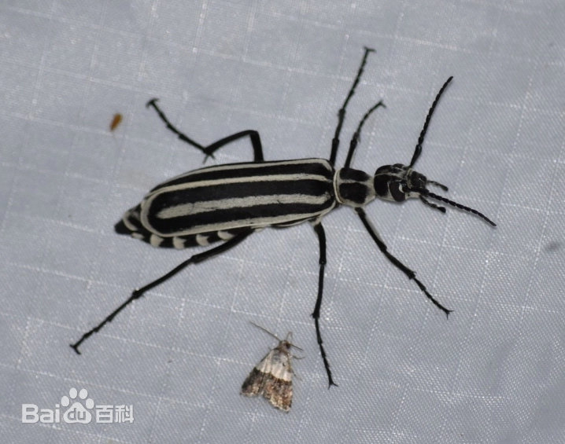
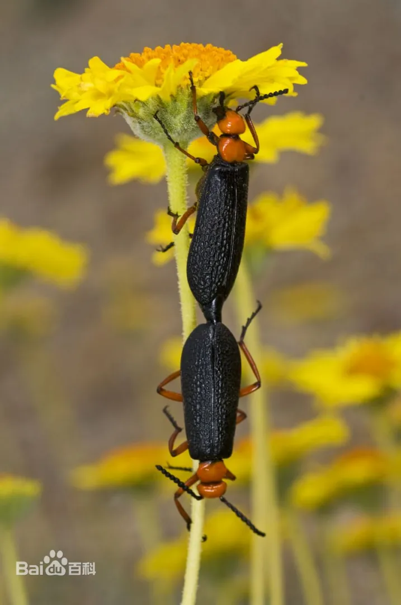

# 芫菁

|   中文名   | 芫菁           | 门     | 节肢动物门 Arthropoda |
| :--------: | -------------- | ------ | --------------------- |
| **外文名** | blister beetle | **纲** | 昆虫纲 Insecta        |
| **别  名** | 斑蝥、地胆     | **目** | 鞘翅目                |
|            |                | **科** | 芫菁科                |

## 特征

> **类别说明：**“芫菁”在本系统中作为芫菁科昆虫的较宽类别使用。芫菁科包含多种生态习性不同的物种，因此只有科级共同特征可以作为通用描述；豆芫菁等具体种类的寄主、季节和生活史信息不得无条件泛化为全部芫菁。

​	芫菁一般为中型，圆筒形或粗短甲虫，体壁和鞘翅较软，体长3-30毫米，通常10-15毫米；颜色多变，有黑色、灰色、褐色、黄褐色，有时有鲜明金属彩色；表面通常有细而很疏的微毛或[阙如](https://baike.baidu.com/item/阙如/10928695?fromModule=lemma_inlink)，少数则有密毛。头下口式，与身体几成垂直，具有很细的颈。复眼大，触角11节，丝状或锯齿状，雄虫[触角](https://baike.baidu.com/item/触角/6268842?fromModule=lemma_inlink)中部几节栉齿状。前胸一般狭于鞘翅基部，鞘翅长达腹端，或短缩露出大部分腹节，质地柔软，两翅在端分离，不合拢。前足基节窝开式，前、中足基节左右相接，后足基节横形，足细长，踏节5-5-4式，爪纵裂为2片，前足基节窝开放。可见腹板6节。根。翅端达腹部第3节 。

|  |  |  |  |
| ------------------------- | ------------------------- | ------------------------- | ------------------------- |

## 为害症状

​	成虫为植食性，可为害豆类、麻类、花生、甜菜、马钤薯、牧草及药用植物等，是农业上的重要害虫，如为害豆类的中华芫菁。 [13]对芫菁可采用深翻灭虫、捕杀成虫、使用药剂进行叶面喷雾等手段来进行防治。

## 防治方法

### 轻度

1. 芫菁具有群集习性，少量发生时优先采用人工捕捉或网捕。[09-T1]
2. 人工处理时必须佩戴手套、穿长袖衣物，避免皮肤接触含斑蝥素的虫体分泌液。[09-T2]
3. 清除田间和周边杂草，减少成虫停留、栖息和取食场所。[09-T2]
4. 低虫量阶段采用挑治，不必无差别全田施药。[09-T1]

### 中度

> 适用范围：以下内容仅作为当前确认样本的可选一般指导；不得依据当前样本自动选择治疗层级。涉及药剂时，须由用户确认目标作物并核对当前产品标签及登记适用范围。

1. 对群集取食区域开展人工捕捉 + 局部药剂挑治。
2. 鄂尔多斯市农牧局针对田间芫菁的技术资料给出了**高效氯氰菊酯、氯氟氰菊酯、氰戊菊酯、溴氰菊酯**等药剂示例。[09-T1]
3. 具体剂量和使用范围必须以当前产品标签及目标作物登记为准，不将旧资料中的浓度自动写死到系统。
4. 施药时避开高温和授粉昆虫活动高峰，并做好人员防护。
### 重度

> 适用范围：以下内容仅针对当前确认样本及其可见组织；当前样本的重度观察不自动推断大面积、产量、采收期或区域防控。涉及药剂时，须由用户确认目标作物并核对当前产品标签及登记适用范围。

1. 轮换不同作用机制，不因严重程度自行提高药量。[09-T2]
2. 严重受害且失去恢复价值的组织或植株，可结合生产要求及时清理。
### 防治措施来源

**[09-T1] A**

title: 达拉特旗：病虫情报动态第二十期——芫菁在我旗首次发生

site: 鄂尔多斯市农牧局 / 达拉特旗农牧技术推广中心

url: https://nmj.ordos.gov.cn/xwdt/qqdt/202302/t20230228_3352605.html

**[09-T2] A**

title: 《大足病虫情报》2026年第十期 红头芫菁的发生及防治方法

site: 重庆市大足区人民政府 / 农业技术服务中心

url: https://www.dazu.gov.cn/qzfbm/qnyncw/zwxx_53317/gggs/202606/t20260622_15768429.html

## 危害

### 内容

**皮肤灼伤、误食致命、眼睛损伤、农业减产、畜牧中毒、危害蜜蜂**

### 内容来源：

 title: 芫菁科

 site: 维基百科

 url: https://zh.wikipedia.org/zh-cn/芫菁科

 title: （二）豆芫菁（Epicauta hirticornis Linn）

 site: 农业知识入口网（农业部）

 url: https://kmweb.moa.gov.tw/subject/subject.php?id=22144&print=Y

 title: 芫菁科昆虫之毒

 site: 搜狐网

 url:https://www.sohu.com/a/807953463_121119271

 title: 芫菁

 site: 智汇三农

 url:https://www.pwsannong.com/c/2016-04-13/556974.shtml

## 可能诱因

### 内容

**田间存在适宜寄主植物和充足食物来源时，有利于成虫活动和取食；部分芫菁种类的幼虫以地下蝗虫卵等虫卵为食。不同芫菁种类的具体发生条件存在差异。**

### 内容来源：

 title: （二）豆芫菁（Epicauta hirticornis Linn）

 site: 农业知识入口网（农业部）

 url: https://kmweb.moa.gov.tw/subject/subject.php?id=22144&print=Y

 title: 芫菁

 site: 百度百科

 url:https://baike.baidu.com/item/芫菁/3376092

 title: 豆芫菁

 site: 七星生态保育基金／步道生态资料库

 url:https://www.7stareco.org.tw/4road/1234/detail/i/I0093.htm
