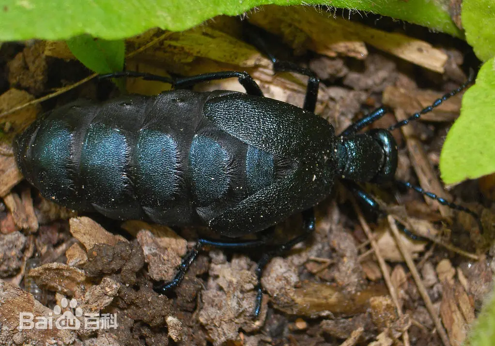
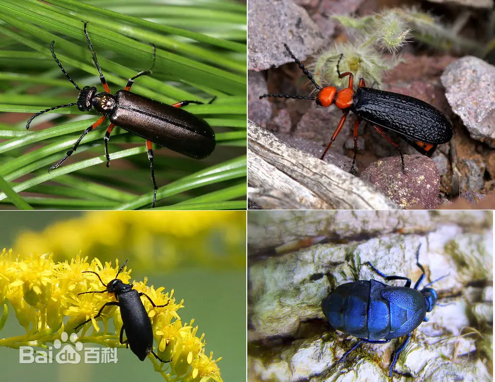

# 芫菁

|   中文名   | 芫菁           | 门     | 节肢动物门 Arthropoda |
| :--------: | -------------- | ------ | --------------------- |
| **外文名** | blister beetle | **纲** | 昆虫纲 Insecta        |
| **别  名** | 斑蝥、地胆     | **目** | 鞘翅目                |
|            |                | **科** | 芫菁科                |

## 特征

​	芫菁一般为中型，圆筒形或粗短甲虫，体壁和鞘翅较软，体长3-30毫米，通常10-15毫米；颜色多变，有黑色、灰色、褐色、黄褐色，有时有鲜明金属彩色；表面通常有细而很疏的微毛或[阙如](https://baike.baidu.com/item/阙如/10928695?fromModule=lemma_inlink)，少数则有密毛。头下口式，与身体几成垂直，具有很细的颈。复眼大，触角11节，丝状或锯齿状，雄虫[触角](https://baike.baidu.com/item/触角/6268842?fromModule=lemma_inlink)中部几节栉齿状。前胸一般狭于鞘翅基部，鞘翅长达腹端，或短缩露出大部分腹节，质地柔软，两翅在端分离，不合拢。前足基节窝开式，前、中足基节左右相接，后足基节横形，足细长，踏节5-5-4式，爪纵裂为2片，前足基节窝开放。可见腹板6节。根。翅端达腹部第3节 。

|  |  |  |  |
| ------------------------- | ------------------------- | ------------------------- | ------------------------- |

## 为害症状

​	成虫为植食性，可为害豆类、麻类、花生、甜菜、马钤薯、牧草及药用植物等，是农业上的重要害虫，如为害豆类的中华芫菁。 [13]对芫菁可采用深翻灭虫、捕杀成虫、使用药剂进行叶面喷雾等手段来进行防治。

## 防治方法

### 物理与农业防治

- **冬季深翻土壤**：在秋冬季节对大豆、花生等作物田进行 20–25 厘米的深翻耕。这能将土中越冬的伪蛹破坏并暴露在地面，使其被冻死或被天敌捕食，从而大幅减少来年虫源。
- **人工网捕成虫**：利用成虫的群集性和假死性，在清晨利用捕虫网将其振落并集中销毁。**切记操作时必须佩戴厚橡胶手套或使用钳子**，绝不能徒手触碰。 [[1](http://www.dahuahuilan.com/show.aspx?itemid=5642)]
- **生态诱集与隔离**：芫菁极为偏爱取食蕨类植物或光果龙葵（乌甜仔菜）。可在农田周边保留或种植这类植物作为缓冲带，诱集害虫进行集中扑杀，保护主作物。

### 生物与绿色防治

- **喷施天然忌避剂**：在成虫发生初期，可在植物表面喷洒[矽藻土](http://www.dahuahuilan.com/show.aspx?itemid=5642)或苦楝油，利用其特殊气味和物理特性让成虫产生忌避行为，减少其落田啃食。
- **保护地下天敌**：芫菁幼虫在地下其实是肉食性的，专以蝗虫卵块为食，属于蝗灾的天然抑制者。在非必要时应减少全田大面积毒土盲目杀虫，维持生态平衡。

### 化学药剂防治

当成虫大面积暴发、群集危害叶片时，应及时在**清晨露水干后或傍晚**进行化学喷雾（避开中午强光）。喷药时要使用扇形喷头，自上而下形成雾幕，并重点针对**叶片背面和根际土壤**进行针对性喷洒。常用高效药剂包括：

- **菊酯类药剂**：[2.5%溴氰菊酯乳油](https://nynct.shaanxi.gov.cn/zt/snzbxx/zbjs/202507/t20250716_3543843.html) 2000–2500 倍液、20%杀灭菊酯乳油 2000 倍液，或氯氰菊酯乳油 3000–4000 倍液。
- **昆虫生长调节剂**：25%灭幼脲悬浮剂 1000 倍液，对环境较友好且持效期长。
