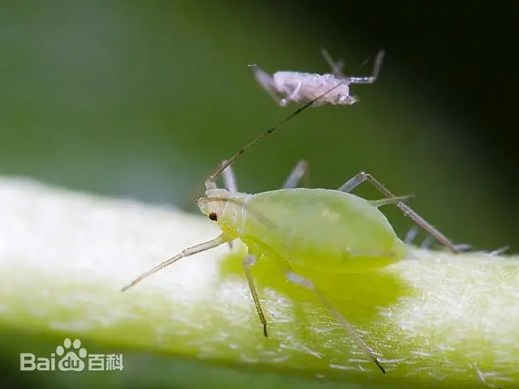
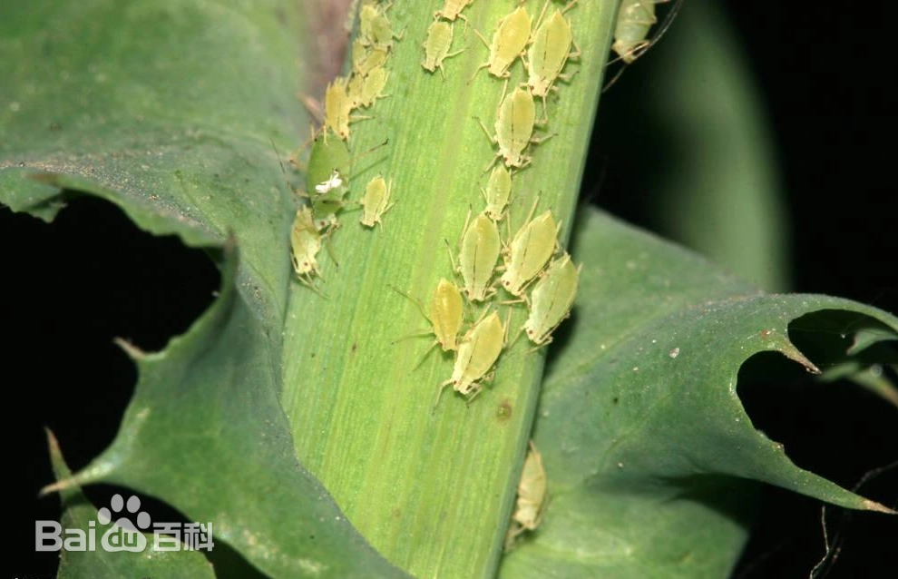

# 蚜虫

|   中文名   | 蚜虫   | 门       | 节肢动物门 Arthropoda                      |
| :--------: | ------ | -------- | ------------------------------------------ |
| **外文名** | Aphids | **纲**   | 昆虫纲 Insecta                             |
| **别  名** |        | **目**   | 半翅目 Hemiptera                           |
|            |        | **类群** | 蚜虫类群，农业上常见种多属于蚜科 Aphididae |

## 特征

蚜虫是一类体型较小、以刺吸式口器取食植物汁液的半翅目昆虫。农业生产中常见种类多属于蚜科（Aphididae）。

成蚜通常体形柔软，多呈梨形，体色可为绿色、黄色、黑色、灰色、红褐色等。许多种类腹部具有一对明显的腹管，这是识别蚜虫的重要形态特征之一。

蚜虫常集中在嫩叶、嫩梢、花蕾或叶片背面吸食汁液，可造成叶片卷曲、黄化、生长受抑。部分种类排泄蜜露并诱发煤污；部分蚜虫还可传播植物病毒。

不同蚜虫种类的寄主和发生规律差异很大，因此本知识库不把某一个具体蚜种的生活史和寄主范围泛化为整个“蚜虫”类别。

|  |  |  |  |
| ----------------------------------------------------- | ----------------------------------- | ----------------------------------------------------- | ----------------------------------------------------- |

## 为害症状

​	[麦蚜](https://baike.baidu.com/item/麦蚜/0?fromModule=lemma_inlink)的危害主要包括直接危害和间接危害两个方面：直接危害主要以成、若蚜吸食叶片、茎秆、嫩头和嫩穗汁液。麦长管蚜多在植物上部[叶片正面](https://baike.baidu.com/item/叶片正面/0?fromModule=lemma_inlink)为害，抽穗灌浆后，迅速增殖，集中危害于穗部。麦二叉蚜喜在作物苗期为害，被害部形成枯斑，其它蚜虫无此症状。间接危害指麦蚜传播小麦病毒病，其中以传播[小麦黄矮病](https://baike.baidu.com/item/小麦黄矮病/53859568?fromModule=lemma_inlink)的危害最大。

​	蚜虫产生危害时会排出大量的蜜露污染叶片和果实，从而引起煤污病的发生，影响植物光合作用，蚜虫还能传播病毒病，造成病毒病的大面积发生。

## 防治方法

### 轻度

1. 清除田边恶性杂草和中间寄主，减少有翅蚜迁入和病毒传播风险。
2. 使用黄板监测有翅成虫，在设施条件下可使用防虫网阻截外来虫源。[10-T1]
3. 保护瓢虫、草蛉、食蚜瘿蚊、蚜茧蜂等天敌。[10-T1]
4. 低虫量阶段优先使用**苦参碱、除虫菊素**等已有登记的生物/植物源药剂，但必须核对目标作物登记。[10-T1][10-T2]

### 中度

> 适用范围：以下内容仅作为当前确认样本的可选一般指导；不得依据当前样本自动选择治疗层级。涉及药剂时，须由用户确认目标作物并核对当前产品标签及登记适用范围。

1. 重点检查嫩梢、叶背和生长点，对虫群集中区域进行针对性处理。
2. 农业农村部和全国农技中心方案中，蚜虫防治常见有效成分包括**吡虫啉、吡蚜酮、啶虫脒、噻虫嗪、氟啶虫酰胺**等；系统推荐前必须核对目标作物登记。[10-T1][10-T2]
3. 施药时保证叶背和嫩梢有效覆盖，同时保护天敌。
4. 如蚜虫可能传播病毒病，应同步加强病毒病株巡查。
### 重度

> 适用范围：以下内容仅针对当前确认样本及其可见组织；当前样本的重度观察不自动推断大面积、产量、采收期或区域防控。涉及药剂时，须由用户确认目标作物并核对当前产品标签及登记适用范围。

1. 根据当前登记选择高效、低风险蚜虫药剂并轮换作用机制，避免抗性累积。[10-T1][10-T2]
2. 不固定要求“每几天喷一次”；具体间隔和最多次数按产品标签执行。
3. 对严重受害并伴随病毒病、失去恢复价值的植株，根据具体作物生产要求及时清理。
### 防治措施来源

**[10-T1] A**

title: 2024年豇豆病虫害绿色防控技术方案

site: 农业农村部 / 全国农技中心

url: https://www.moa.gov.cn/ztzl/2024cg/jszd_29651/202403/P020240322565099338361.pdf

**[10-T2] A**

title: 2025年玉米重大病虫害防控技术方案

site: 平凉市农业农村局（转发全国农技中心方案）

url: https://nync.pingliang.gov.cn/xwdt/syjs/art/2025/art_0485c41ab99c48118b0f74868d20c84d.html
