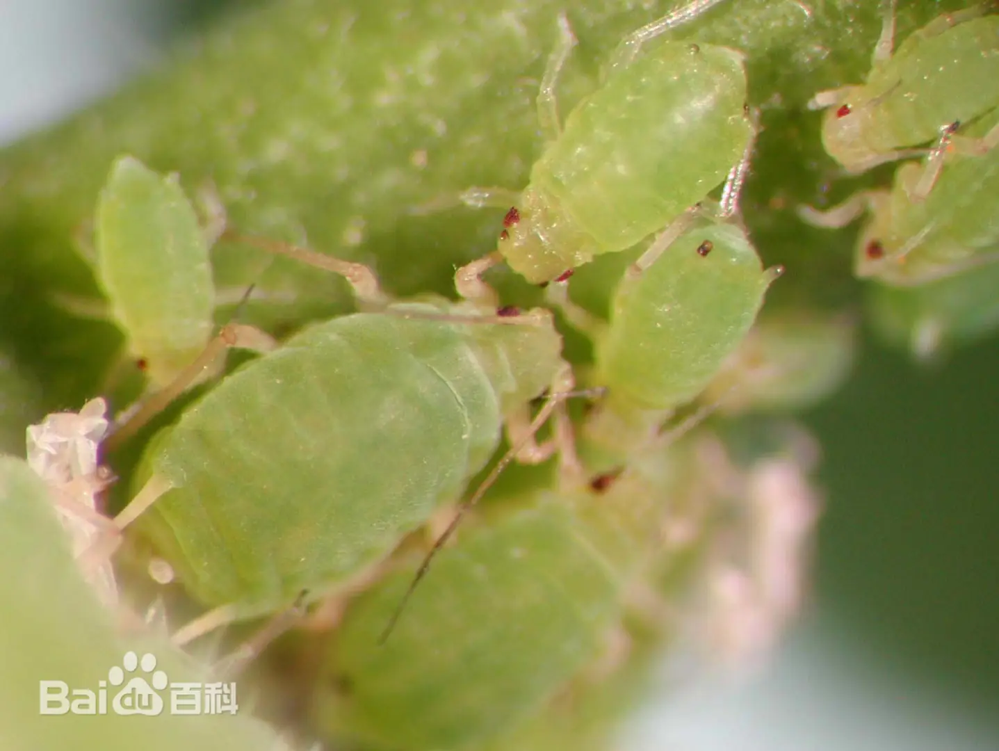
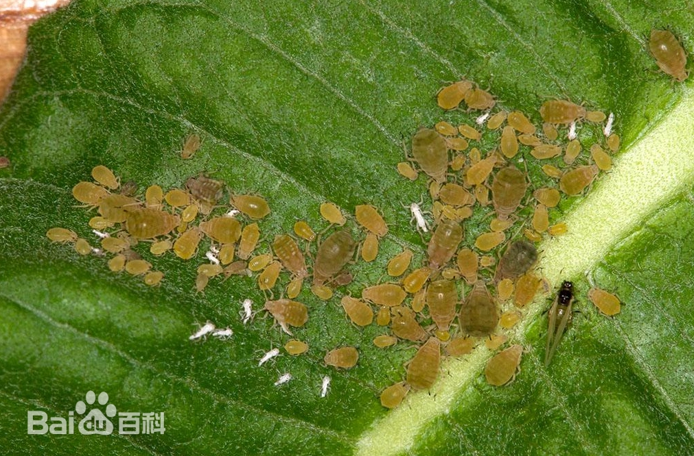

# 蚜虫

|   中文名   | 蚜虫             | 门     | 节肢动物门                                                   |
| :--------: | ---------------- | ------ | ------------------------------------------------------------ |
| **外文名** | Aphids           | **纲** | 昆虫纲                                                       |
| **别  名** | 蚱蜢、草蜢、蚂蚱 | **目** | 半翅目                                                       |
|            |                  | **科** | 球蚜总科和[蚜总科](https://baike.baidu.com/item/蚜总科/0?fromModule=lemma_inlink) |

## 特征

​	蚜虫，是半翅目蚜总科的统称，包括蚜总科下的所有成员；常分为头、胸、腹三部分；腹管无、环状或管状。体长1.5～4.9毫米，多数约2毫米。体表光滑或分泌蜡粉、蜡丝覆盖虫体。触角6节，少数5节，罕见4节，感觉圆圈形,罕见椭圆形，末节端部常长于基部。眼大，多小眼面，常有突出的3小眼面眼瘤。喙末节短钝至长尖。腹部大于头部与胸部之和。前胸与腹部各节常有缘瘤。腹管通常管状，长常大于宽，基部粗，向端部渐细，中部或端部有时膨大，顶端常有缘突，表面光滑或有瓦纹或端部有网纹，罕见生有或少或多的毛，罕见腹管环状或缺。尾片多为半圆形、瘤状、长短不等的圆锥形、三角形和五角形等。尾板末端圆。表皮光滑、有网纹或皱纹或由微刺或颗粒组成的斑纹。体毛顶端尖锐或平钝，有时膨大为头状或扇状。有翅蚜触角通常6节，第3或3及4或3～5节有次生感觉圈。前翅中脉通常分为3支，少数分为2支。后翅通常有肘脉2支，罕见后翅变小，翅脉退化。翅脉有时镶黑边。身体半透明，大部分是绿色或是白色。

|  |  |  |  |
| ----------------------------------------------------- | ----------------------------------- | ----------------------------------------------------- | ----------------------------------------------------- |

## 为害症状

​	[麦蚜](https://baike.baidu.com/item/麦蚜/0?fromModule=lemma_inlink)的危害主要包括直接危害和间接危害两个方面：直接危害主要以成、若蚜吸食叶片、茎秆、嫩头和嫩穗汁液。麦长管蚜多在植物上部[叶片正面](https://baike.baidu.com/item/叶片正面/0?fromModule=lemma_inlink)为害，抽穗灌浆后，迅速增殖，集中危害于穗部。麦二叉蚜喜在作物苗期为害，被害部形成枯斑，其它蚜虫无此症状。间接危害指麦蚜传播小麦病毒病，其中以传播[小麦黄矮病](https://baike.baidu.com/item/小麦黄矮病/53859568?fromModule=lemma_inlink)的危害最大。

​	蚜虫产生危害时会排出大量的蜜露污染叶片和果实，从而引起煤污病的发生，影响植物光合作用，蚜虫还能传播病毒病，造成病毒病的大面积发生。

## 防治方法

### **药物防治**

​	发现大量蚜虫时，及时喷施农药。用50%马拉松乳剂1000倍液，或 50%杀螟松乳剂1000倍液，或50%抗蚜威可湿性粉剂3000倍液，或2.5%溴氰菊酯乳剂3000倍液，或2.5%灭扫利乳剂3000倍液，或40%吡虫啉水溶剂1500～2000倍液等，喷洒植株1～2次；用1:6—1:8的比例配制辣椒水（煮半小时左右），或用1:20—1:30的比例配制洗衣粉水喷洒，或用1:20:400的比例配制洗衣粉、尿素、水混合溶液喷洒，连续喷洒植株2～3次；对桃粉蚜一类本身披有蜡粉的蚜虫，施用任何药剂时，均应加入1%肥皂水或洗衣粉,增加粘附力，提高防治效果。

### **人工防治**

​	秋、冬季在树干基部刷白，防止蚜虫产卵；结合修剪，剪除被害枝梢、残花，集中烧毁，降低越冬虫口；冬季刮除或刷除树皮上密集越冬的卵块，及时清理残枝落叶，减少越冬虫卵；春季花卉上发现少量蚜虫时，可用毛笔蘸水刷净，或将盆花倾斜放于自来水下旋转冲洗。

### **保护天敌**

​	蚜虫的天敌很多，有瓢虫、草蛉、食蚜蝇和寄生蜂等，对蚜虫有很强的抑制作用。尽量少施广谱性农药，避免在天敌活动高峰时期施药，有条件的可人工饲养和释放蚜虫天敌。
