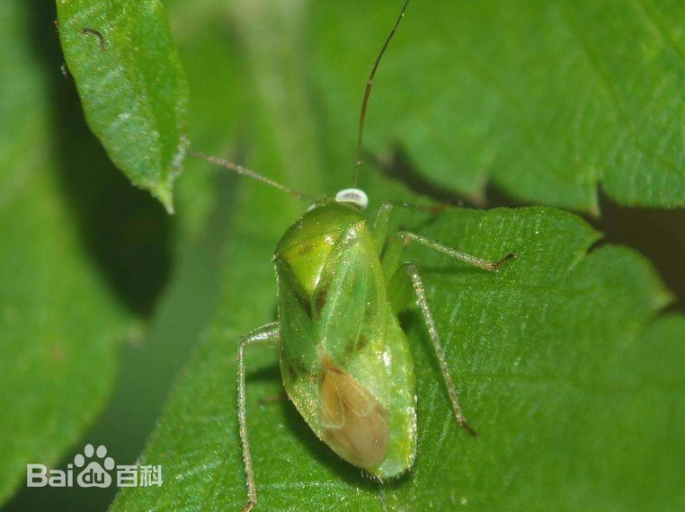
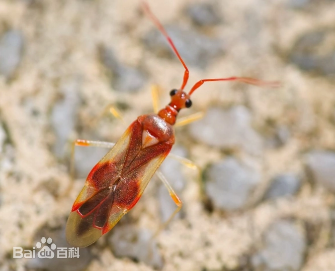
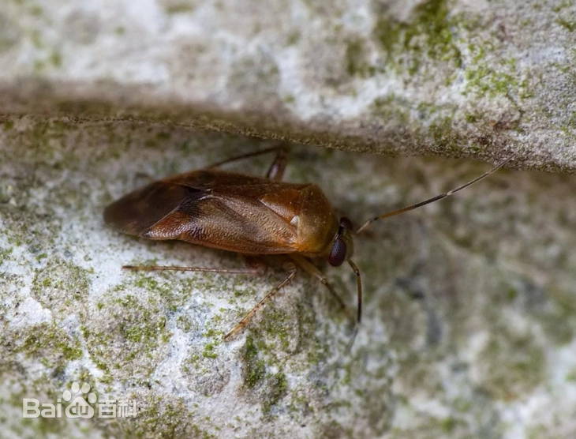
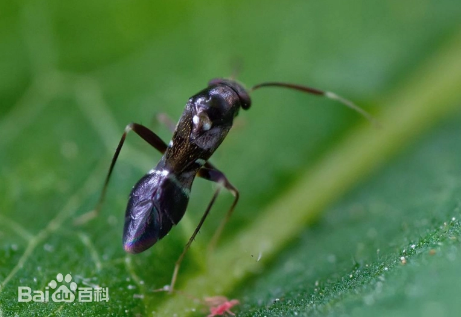

# 盲蝽科

|   中文名   | 盲蝽科               | 门     | 节肢动物门 Arthropoda |
| :--------: | -------------------- | ------ | --------------------- |
| **外文名** | Mirid bugs (Miridae) | **纲** | 昆虫纲 Insecta        |
| **别  名** |                      | **目** | 半翅目                |
|            |                      | **科** | 盲蝽科                |

## 特征

> **类别说明：**盲蝽科（Miridae）包含大量不同物种，不同种类的寄主、体色、生活史和危害部位差异较大。本知识库只保存盲蝽科层面的共同特征；具体物种特征不得直接泛化到全部盲蝽。

​	盲蝽科Miridae (plant bugs, leaf bugs) 属半翅目，科名出自拉丁文Mirus 意为wonderful 。体小型，稍扁平，触角4节，除树盲蝽亚科外，其余亚科无单眼。前翅革质部分分为革片、爪片和楔片。膜区由翅脉在基部围成两个翅室。从侧面看，膜区与革区呈一角度。前胸背板前缘常具一横沟，从而划出一个狭长的区域叫领片，其后2个低的突起叫 。

​	植食性，是半翅目中最大的一个科之一，有近万种，中国已知500种，如绿盲蝽Lygus lucorum Meyer-Dur 、苜蓿盲蝽 Adelphocoris lineolatus 、 三点盲蝽A . fsdciaticollis 等。

​	小型至中型,身体质地比较脆弱。体色多样,由灰暗、黄、褐、黑色至鲜艳的绿色、橙色、红色等均有

​	有些种类具有鲜明的花斑。体形亦较多样，多数为长椭圆形或椭圆形；部分类群长梭形，适应在狭叶的禾草上生活；亦有若干拟蚁的种类，其头的基部束缢成颈状，腹基及翅的基部狭窄而成束腰状，以致外观近似蚂蚁，若虫亦有类似的拟态。盲蝽科头部多倾斜或垂直，侧叶（下颚叶）短小，无单眼。触角4节。喙4节。前胸背板梯形,前端常以横沟划分出一狭窄的领圈。小盾片明显，其前方的中胸盾片后端常因未被前胸背板遮盖而露出，与小盾片连成一体。前翅爪片远伸过小盾片末端，爪片接合缝甚长。有楔片缝和楔片。膜片基部有1～2个封闭而完整的翅室，所占面积一般小于膜片之半。足多纤细，后足腿节有时加粗,适于跳跃。跗节3节。前跗节除具爪垫外，在爪间具有各种形式的副爪间突 (parempodium)。臭腺开口很大,其周围的臭腺孔缘(peritreme)隆起发达。腹部长圆筒状，无明显的侧接缘。雄虫腹部末端形状两侧不对称，左右抱器的形状亦完全不同。雌虫产卵器针状。 卵香蕉形,具卵盖,卵盖上有细长的角状突起，用作卵呼吸时气体交换的通道。卵产于寄主植物组织中，往往只有卵盖暴露在外。若虫体壁软弱，足及触角纤细。腹部只有第3～4腹节节间有臭腺开口。

|  |  |  |  |
| --------------------------- | --------------------------- | --------------------------- | --------------------------- |

## 为害症状

**刺吸嫩部**：专挑植物最嫩的部位（如新梢、幼叶、花蕾）吸取营养。

**叶片破碎**：被害叶展开后呈现许多小孔，边缘枯焦，严重时叶片皱缩畸形。

**蕾果脱落**：花蕾受害易枯死脱落，幼果受害会产生黑褐色凹陷斑，导致畸形果或落果。

**寄主广泛**：可为害棉花、果树（苹果、桃、枣）、茶树、玉米及多种蔬菜。

## 防治方法

### 轻度

1. 清除田边恶性杂草和明显替代寄主，减少盲蝽迁入和栖息场所。
2. 加强嫩梢、花蕾、幼果和田边区域巡查，尽早发现若虫和新鲜危害点。
3. 保护蜘蛛、草蛉等自然天敌，低虫量阶段优先使用生态和物理措施。
4. 如作物已有登记，可优先考虑金龟子绿僵菌等低风险生物防治产品。[08-T1]

### 中度

1. 针对嫩叶、生长点、花蕾和幼果等虫体集中的位置进行重点防治。
2. 官方棉花防控方案针对棉盲蝽列出的有效成分包括**金龟子绿僵菌 CQMa421、啶虫脒、噻虫嗪、氟啶虫胺腈**；系统只能在当前产品明确登记于目标作物和盲蝽时推荐使用。[08-T1]
3. 同步管理田边杂草和替代寄主，降低施药后再次迁入。
4. 轮换作用机制，避免反复使用单一药剂。

### 重度

1. 大范围持续发生时采取区域协调防控，而不是仅处理单株。
2. 使用当地登记的盲蝽防治药剂，并重点处理田边迁入带和严重受害区。[08-T1]
3. 不因“重度”提高标签剂量或采用未经登记的混配方案。
4. 对严重受害、已经失去商品价值或恢复价值的嫩梢、花果，可结合具体作物栽培要求进行清理。

### 防治措施来源

**[08-T1] A**

title: 关于印发2024年油料经济作物重大病虫害防控技术方案的通知

site: 湖北省农业农村厅

url: https://nyt.hubei.gov.cn/bmdt/yw/zbzh/202404/t20240403_5147799.shtml
