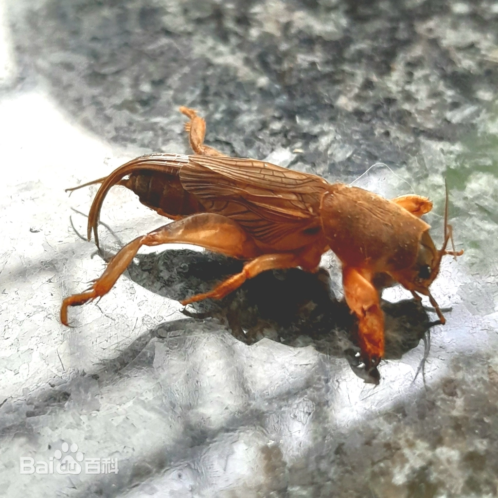
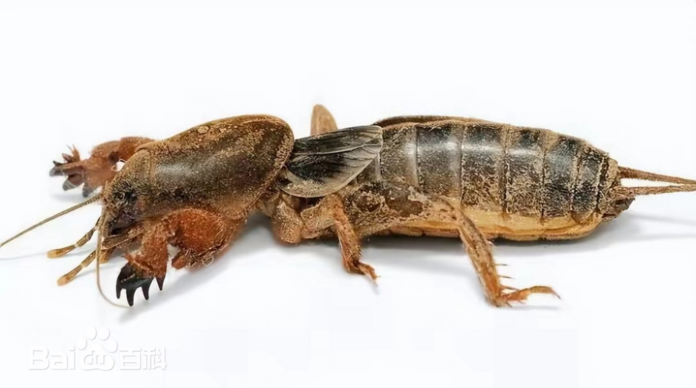
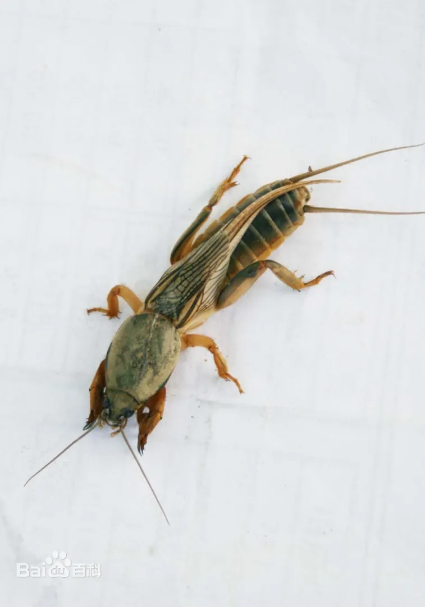
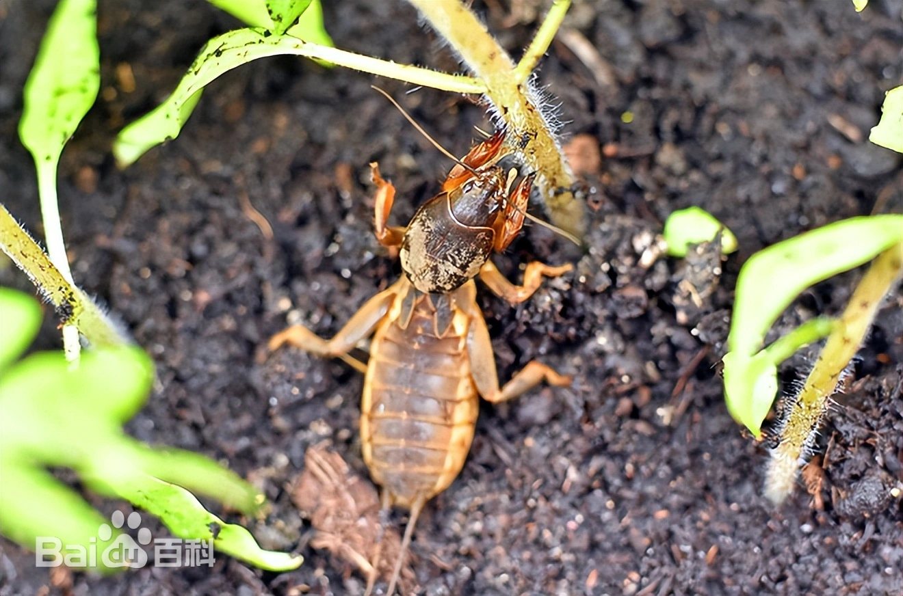

# 蝼蛄

|   中文名   | 蝼蛄          | 门     | 节肢动物门 Arthropoda |
| :--------: | ------------- | ------ | --------------------- |
| **外文名** | Mole crickets | **纲** | 昆虫纲 Insecta        |
| **别  名** |               | **目** | 直翅目 Orthoptera     |
|            |               | **科** | 蝼蛄科 Gryllotalpidae |

## 特征

蝼蛄科（Gryllotalpidae）昆虫大部分时间生活在土壤中，身体通常较粗壮、呈圆筒状，最显著特征是前足高度特化为适于挖掘的挖掘足。

前足胫节和跗节具有强壮的齿状或刀片状结构，可用于挖掘地下隧道。蝼蛄在土壤中活动时可直接损伤幼苗根系和地下组织，也可因打洞造成幼苗根系与土壤接触受影响。

不同蝼蛄种类的体色、体长和生活史存在差异，因此不把某一具体种类的颜色和尺寸作为整个蝼蛄科的固定特征。

|  |  |  |  |
| ------------------------- | ------------------------- | ------------------------- | ------------------------- |

## 为害症状

​	蝼蛄是重要的农业害虫， [4]主要危害小麦、玉米等禾本科作物，也可能危害棉花、烟草、蔬菜、树苗等。 虽然双子叶作物也会受到影响，但禾本科作物的幼苗往往受害更严重 。例如，非洲蝼蛄在中国南方危害水稻，台湾蝼蛄在中国台湾危害甘蔗。

它们经常咬食播下的种子，尤其是刚发芽的种子，导致苗期减少；同时也会咬食作物的根部，造成幼苗枯死或生长不良。夜间活动时，它们会咬食靠近地面的嫩茎，甚至将幼苗咬断。在土壤中穿行时，蝼蛄会挖掘出纵横交错的隧道，导致土壤松动，作物的根系与土壤分离，引发严重的缺苗和断垅现象。 在中国北方的旱田中，由于蝼蛄的活动，作物的幼苗与土壤分离，导致作物失水而枯死。

​	在菜地和温室里，经常地大量浇水会增加蝼蛄的活动，在浇水后形成它们的活跃期，对作物造成更大的危害。它们不仅对禾谷类作物造成影响，还会对林木苗圃和其他特种作物造成损害，因此可以被称为主要的土壤害虫。此外，蝼蛄对同一种植物在不同的生长阶段的影响程度也会有很大的差异。例如蝼蛄可能会危害小麦的种子、幼苗甚至到拔节期的小麦，但不会对已经结实的小麦穗产生危害。

## 防治方法

### 轻度

1. 结合播前整地和轮作倒茬，降低地下害虫适生条件。[13-T1]
2. 使用充分腐熟的有机肥，避免未腐熟有机物吸引地下害虫。
3. 成虫活动期可采用灯光等物理方式辅助监测和诱杀。
4. 在已有登记的作物上，可使用绿僵菌、白僵菌等微生物制剂进行地下害虫生物防治。[13-T1]

### 中度

1. 对出现明显地表隧道、缺苗断垄的区域进行重点处理。
2. 播种期可选择当前登记含**吡虫啉、噻虫嗪**等成分的种衣剂用于地下害虫预防。[13-T1]
3. 已发生危害的田块，如需土壤处理或灌根，只选择当前登记用于目标作物和蝼蛄的产品，不使用未经登记的自配敌敌畏等高风险灌洞方案。[13-T1]
4. 配合补苗和土壤管理，降低持续危害。

### 重度

1. 大面积缺苗时结合地下害虫综合防治、补苗补种和耕作制度调整。
2. 化学防治仍必须使用合法登记产品，不因重度使用高浓度灌洞或“全田化学封锁”。
3. 下一茬加强轮作、深翻和种子处理，降低虫源。
4. 必要时请当地农技人员根据土壤虫口调查制定田块级方案。

### 防治措施来源

**[13-T1] A**

title: 志丹：春播期间地下害虫防治技术

site: 陕西省农业农村厅

url: https://nynct.shaanxi.gov.cn/zt/snzbxx/zbjs/202505/t20250509_3515856.html

**[13-T2] A**

title: 春耕时节合理选购农药指导意见

site: 宁夏回族自治区农业农村厅 / 自治区农业技术推广总站

url: https://nynct.nx.gov.cn/xwzx/zwdt/202502/t20250217_4826741.html
