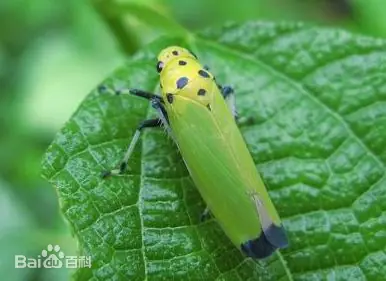
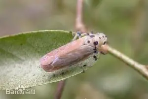
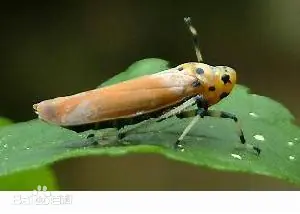
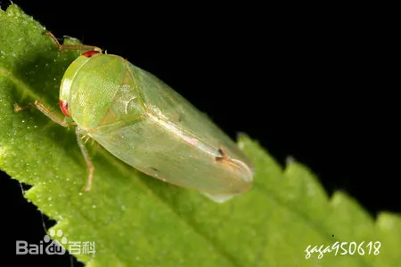

# 叶蝉科

|   中文名   | 叶蝉科                      | 门     | 节肢动物门 |
| :--------: | --------------------------- | ------ | ---------- |
| **外文名** | Leafhoppers  (Cicadellidae) | **纲** | 昆虫纲     |
| **别  名** | 蚱蜢、草蜢、蚂蚱            | **目** | 半翅目     |
|            |                             | **科** | 叶蝉科     |

## 特征

​	成虫 黄绿色或绿色，头顶前缘两复眼间有l条黑色横带，翅端三分之一处，雄虫黑[褐色](https://baike.baidu.com/item/褐色/0?fromModule=lemma_inlink)，雌虫淡褐色或灰白色。

卵 长约1.2毫米，长椭圆形，一端略尖，初产时白色半透明，后变淡黄褐色，近孵化前一端有l对红色眼点，卵粒单层整齐排列，每块有卵3～26粒。若虫 5龄，中、后胸背面中央各有一倒“八”字形褐纹。

​	小型昆虫，长仅3～12毫米，亦有体长超出1厘米的种。外形似蝉。[单眼](https://baike.baidu.com/item/单眼/0?fromModule=lemma_inlink)2或缺，位于头顶边缘或头顶与额之间。[触角](https://baike.baidu.com/item/触角/0?fromModule=lemma_inlink)着生于两单眼之间或单眼之前。雄虫无鸣器。后足[胫节](https://baike.baidu.com/item/胫节/0?fromModule=lemma_inlink)有梭脊，上生刺毛，下方具两列粗大而明显的刺，这是区别相近种类的重要特征。后足基节伸达腹板侧缘，[产卵器](https://baike.baidu.com/item/产卵器/0?fromModule=lemma_inlink)锯齿状。卵长椭圆形，中间微弯曲。若虫与成虫外形相似。

​	本科昆虫体小，外形似蝉，触角粗大的第2节上无感觉孔。中胸无翅基片，前翅2条臀脉在基部不合并。单眼2或缺。特别是后足胫节有梭脊，上生刺毛，其中有2排粗大而明显的刺，这是区别相近种类的重要特征。

|  |  |  |  |
| ------------------------------------------------------- | ------------------------------------------------------- | ------------------------------------------------------- | ------------------------------------------------------- |

## 为害症状

​	该科昆虫均以植物为食，成虫、若虫均刺吸植物汁液，叶片被害后出现淡白点，而后点连成片，直至全叶苍白枯死。也有的造成枯焦斑点和斑块，使叶片提前脱落。很多种是农林业的重要害虫，如[大青叶蝉](https://baike.baidu.com/item/大青叶蝉/0?fromModule=lemma_inlink)（Cicadella viridis (Linnaeus）、[黑尾叶蝉](https://baike.baidu.com/item/黑尾叶蝉/0?fromModule=lemma_inlink)、[白翅叶蝉](https://baike.baidu.com/item/白翅叶蝉/0?fromModule=lemma_inlink)、[小绿叶蝉](https://baike.baidu.com/item/小绿叶蝉/0?fromModule=lemma_inlink)、[菱纹叶蝉](https://baike.baidu.com/item/菱纹叶蝉/0?fromModule=lemma_inlink)等。有些种类还传布植物病毒病，如[稻普通矮缩病](https://baike.baidu.com/item/稻普通矮缩病/0?fromModule=lemma_inlink)、桑萎缩病、小麦红矮病等。

## 防治方法

### 农业防治

1. 因地制宜改革耕制度，在单、双季稻混栽地区，尽量压缩单季稻种植面积，减少桥梁田。
2. 品种合理布局，实行同品种、同生育期的水稻辖连片种植，避免插花种植。
3. 加强肥水[管理](https://baike.baidu.com/item/管理/0?fromModule=lemma_inlink)。使水稻前期不猛发披叶，中期不脱肥落黄，后期不贪青晚熟，增加耐虫能力。
4. 改进栽培技术。
5. 选育高产抗虫品种。

### 人工物理防治

​	灯光诱杀。扑灯的成虫80%以上是雌的。而且多为怀卵的。灯光诱杀可在6月下旬至8月分成虫盛发期进行。人工捕杀。用捕虫网或拖网捕杀。

### [化学防治](https://baike.baidu.com/item/化学防治/8310049?fromModule=lemma_inlink)

​	在迁飞高峰期防治1-2次；晚稻秧田则在秧苗现青后第隔5-7天用药1次。

​	常用药剂：[马拉硫磷](https://baike.baidu.com/item/马拉硫磷/0?fromModule=lemma_inlink)、锐劲特、50%[二嗪磷](https://baike.baidu.com/item/二嗪磷/0?fromModule=lemma_inlink)乳油。
