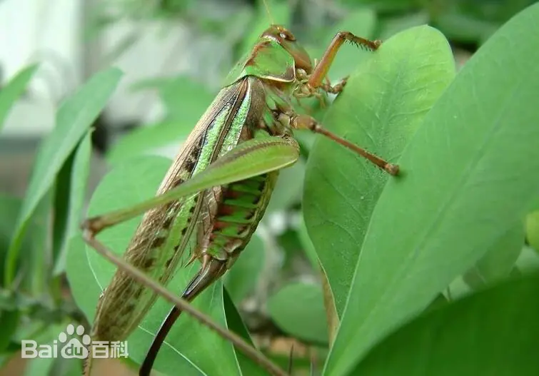
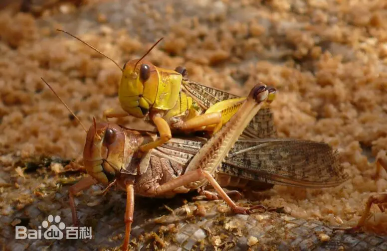
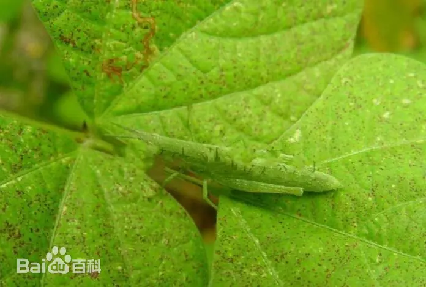
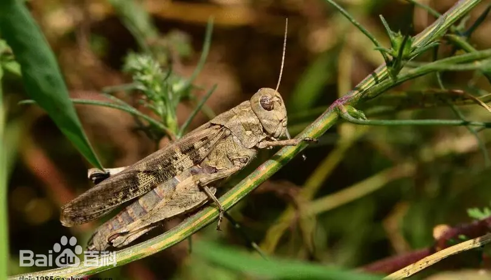

# 蝗总科

|   中文名   | 蝗总科                     | 门     | 节肢动物门 Arthropoda  |
| :--------: | -------------------------- | ------ | ---------------------- |
| **外文名** | Grasshoppers (Locustoidea) | **纲** | 昆虫纲 Insecta         |
| **别  名** | 蚱蜢、草蜢、蚂蚱           | **目** | 直翅目                 |
|            |                            | **科** | 蝗科、剑角蝗科、蚱蜢科 |

## 特征

​	蝗虫的身体可分为头部、胸部和腹部三部分,每一部分都具有附属器官,它们的结构分述如下。

​	头部为卵圆形、三角形或圆锥形。头的前面为颜面。颜面中央呈纵隆起部分为颜面隆起。颜面隆起有的宽平,有的中央具纵沟,有的纵沟仅在中单眼上或下具有,有的仅在中单眼处凹陷。颜面隆起的侧缘有的近平行,有的下端扩大,有的中央收缩而两端扩大。在颜面的两侧,触角基部外方具细隆线,为颜面侧隆线;颜面侧隆线有的粗大呈片状突起,有的较细而不明显,有的直而有的弯曲。复眼下端的细沟,称眼下沟;眼下沟是颜面和颊的分界线。头的背面,在两复眼之前的部分为头顶,头顶之后为后头。从头部的侧面观,头顶与颜面常成直角形、钝角形或锐角形。头部背面平坦或凹陷,头顶的前端呈锐角形、钝角形或圆形,有的具中隆线,有的无中隆线

|  |  |  |  |
| --------------------------- | --------------------------- | --------------------------- | --------------------------- |

## 为害症状

​	蝗虫是农、林、牧业生态系统的重要组成部分，不少有害蝗种对农、林、牧业可造成不同程度危害。全世界的蝗虫已有1万种以上，其中对农、林、牧业可造成危害的蝗虫约300种左右，全球除南极洲、欧亚大陆北纬550以北地区外均可发生蝗虫。全世界常年发生蝗虫的面积达4680万km2，全球1/8的人口经常受到蝗灾的袭扰。全世界发生为害最严重的蝗虫为沙漠蝗Schistocercagregaria，其中最大扩散面积可达2800万km2，包括66个国家的全部和部分地区，约占全世界陆地面积的20%，受灾人口约占全世界人口的1/10以上。中国于1971年在西藏自治区聂拉木县的樟木地区曾采到散居型沙漠蝗虫。

​	80年代以来，中国北方牧区及农牧交错区的各季草场的蝗虫，其发生特点是种类多、密度大、最大发生面积据不完全统计，1985年可达2000多万平方百米。近十几年来，常年受灾面积约460多万平方百米，实际防治面积约100万平方百米左右。1998年，中国牧区及农牧交错区的新疆维吾尔自治区的伊犁、阿尔泰以及内蒙古自治区草原均发生了高密度蝗群，发生面积达数百万公顷以上。1999年，新疆维吾尔自治区的伊犁、阿尔泰、昌吉、巴里坤等地区上报的蝗虫发生面积约4000万亩，发生蝗虫种类主要为[意大利蝗](https://baike.baidu.com/item/意大利蝗/0?fromModule=lemma_inlink)、戟纹蝗、[西伯利亚蝗](https://baike.baidu.com/item/西伯利亚蝗/0?fromModule=lemma_inlink)、[黑条小车蝗](https://baike.baidu.com/item/黑条小车蝗/0?fromModule=lemma_inlink)等，发生密度600～8000头/平方米，个别地区可高达10000头/平方米。各蝗区已经分别采取超低量制剂、[微孢子虫](https://baike.baidu.com/item/微孢子虫/0?fromModule=lemma_inlink)、招引纷红椋鸟和牧鸡治蝗等多种方法进行了治理。

​	中国已知蝗虫在900种以上，其中对农、林、牧业可造成危害的约60余种。对[禾本科植物](https://baike.baidu.com/item/禾本科植物/0?fromModule=lemma_inlink)可造成较大危害的蝗虫主要有[东亚飞蝗](https://baike.baidu.com/item/东亚飞蝗/0?fromModule=lemma_inlink)Locustamigratoriamanilensis、[稻蝗](https://baike.baidu.com/item/稻蝗/0?fromModule=lemma_inlink)Ox-yaspp、蔗蝗Hieroglyphusspp 和尖翅蝗Epacromiusspp等。危害豆类、马铃薯、甘薯等作物的种类有[短星翅蝗](https://baike.baidu.com/item/短星翅蝗/0?fromModule=lemma_inlink)CalliptamusabpeviatusIkonnikov、苯蝗HaplotropispunerianaSaussure、[负蝗](https://baike.baidu.com/item/负蝗/0?fromModule=lemma_inlink)Aractomorphaspp等。[棉蝗](https://baike.baidu.com/item/棉蝗/0?fromModule=lemma_inlink)Chondracrisrosearosea和负蝗可危害棉花。[竹蝗](https://baike.baidu.com/item/竹蝗/0?fromModule=lemma_inlink)Ceracrisspp可严重危害竹林。在广大牧区，危害牧草的种类也很多，主要有[西伯利亚蝗](https://baike.baidu.com/item/西伯利亚蝗/0?fromModule=lemma_inlink)Gomphocerussibiricus、戟纹蝗Dociostaurusspp、[小车蝗](https://baike.baidu.com/item/小车蝗/0?fromModule=lemma_inlink)Oedaleusspp、牧草蝗Omocestusspp、雏蝗Chorthippusspp、痂蝗Bryodemaspp 以及[意大利蝗](https://baike.baidu.com/item/意大利蝗/0?fromModule=lemma_inlink)Calliptamusitalicus等，大发生时可严重为害牧草和农作物并直接影响农牧业的发展。根据中国几千年来史籍的记载，造成农业上毁灭性灾害的蝗虫，主要就是飞蝗，并认为干旱与飞蝗同年发生的机遇率或相关性最大，其次为前一年干旱以及先涝后旱，蚂蚱成片；蝗虫灾害与水、旱灾害常此起彼伏，交替发生，一直是严重威胁中国农业生产、影响人民生活的三大自然灾害。

## 防治方法

### 生态防治

1. 改变环境：改造蝗虫产卵地，如兴修水利、垦荒种树，破坏其生存和产卵环境。
2. 调整作物：在发生区减少种植玉米、小麦等主食作物，改种蝗虫不爱吃的作物。
3. 清除杂草：秋季或春季翻耕土壤、铲除田埂杂草，直接破坏或消灭土中的蝗卵。

### 生物防治

1. 保护天敌：保护和利用青蛙、鸟类及鸡、鸭等天敌捕食蝗虫。
2. 使用菌剂：在若虫期喷施联合国粮农组织推荐的生物农药，如绿僵菌或蝗虫微孢子虫，使蝗虫感染生病死亡。

### 化学防治

1. 药剂喷洒：在蝗灾爆发或高密度发生时，使用高效低毒的杀虫剂（如马拉硫磷、高效氯氟氰菊酯）进行局部或飞防喷杀。
2. 严控时期：抓住3龄以前的若虫集中区域进行围歼，防止扩散成群。
