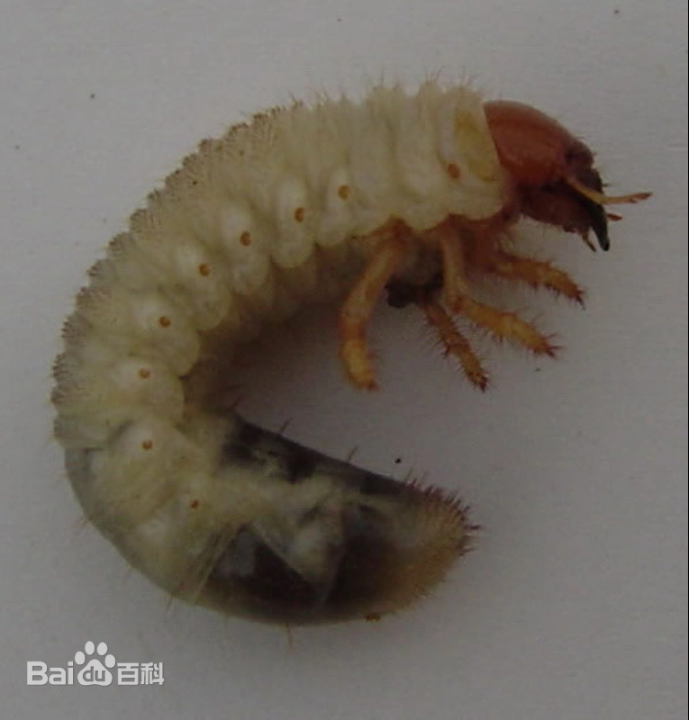
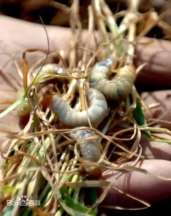
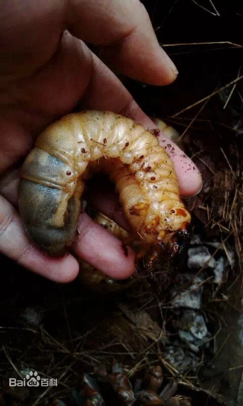
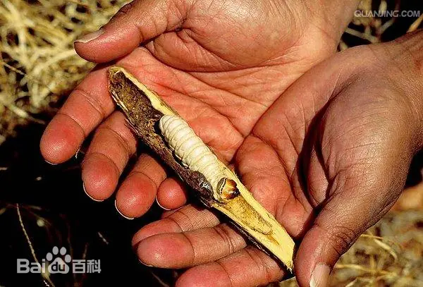

# 蛴螬

|   中文名   | 蛴螬        | 类群     | 金龟子类幼虫           |
| :--------: | ----------- | -------- | ---------------------- |
| **外文名** | White grubs | **纲**   | 昆虫纲 Insecta         |
| **别  名** | 金龟子幼虫  | **目**   | 鞘翅目 Coleoptera      |
|            |             | **总科** | 金龟总科 Scarabaeoidea |

## 特征

> **类别说明：**蛴螬是多种金龟子类甲虫幼虫的统称，并非单一物种。不同种类在体型、生活史、寄主和发生时期上存在差异，因此知识库只采用地下危害和 C 型幼虫等共同特征。

​	蛴螬体肥大，较一般虫类大，体型弯曲呈C型，多为白色，少数为黄白色。头部褐色，上颚显著，腹部肿胀。[体壁](https://baike.baidu.com/item/体壁/7832267?fromModule=lemma_inlink)较柔软多皱，体表疏生细毛。头大而圆，多为黄褐色，生有[左右对称](https://baike.baidu.com/item/左右对称/3967309?fromModule=lemma_inlink)的刚毛，刚毛数量的多少常为分种的特征。如[华北大黑鳃金龟](https://baike.baidu.com/item/华北大黑鳃金龟/9485507?fromModule=lemma_inlink)的幼虫为3对，[黄褐丽金龟](https://baike.baidu.com/item/黄褐丽金龟/3720338?fromModule=lemma_inlink)幼虫为5对。蛴螬具胸足3对，一般后足较长。腹部10节，第10节称为[臀节](https://baike.baidu.com/item/臀节/3177381?fromModule=lemma_inlink)，臀节上生有[刺毛](https://baike.baidu.com/item/刺毛/3587218?fromModule=lemma_inlink)，其数目的多少和排列方式也是分种的重要特征。

|  |  |  |  |
| ---------------------------------------------------- | ----------------------------------------------------- | ------------------------- | ----------------------------------------------------- |

## 为害症状

​	蛴螬对果园苗圃、[幼苗](https://baike.baidu.com/item/幼苗/7662405?fromModule=lemma_inlink)及其他作物的危害主要是春秋两季最重。蛴螬咬食幼苗嫩茎，薯芋类[块根](https://baike.baidu.com/item/块根/10957745?fromModule=lemma_inlink)被钻成孔眼，当[植株](https://baike.baidu.com/item/植株/10940547?fromModule=lemma_inlink)枯黄而死时，它又转移到别的植株继续危害。此外，因蛴螬造成的伤口还可诱发病害。其中[植食性](https://baike.baidu.com/item/植食性/20258590?fromModule=lemma_inlink)蛴螬食性广泛，危害多种农作物、[经济作物](https://baike.baidu.com/item/经济作物/6442251?fromModule=lemma_inlink)和[花卉苗木](https://baike.baidu.com/item/花卉苗木/6086476?fromModule=lemma_inlink)，喜食刚播种的种子、根、[块茎](https://baike.baidu.com/item/块茎/6733502?fromModule=lemma_inlink)以及幼苗，是世界性的[地下害虫](https://baike.baidu.com/item/地下害虫/9371484?fromModule=lemma_inlink)，危害很大。

## 防治方法

### 轻度

1. 播前或收获后深翻、清茬，减少土壤中幼虫和蛹的存活机会。[11-T1][11-T2]
2. 使用充分腐熟的有机肥，降低地下害虫适生条件。
3. 成虫期可结合杀虫灯等方式监测和诱杀金龟子成虫。
4. 在适宜作物上可使用**金龟子绿僵菌、球孢白僵菌**等生物防治产品进行土壤处理。[11-T1]

### 中度

1. 对已出现缺苗、萎蔫和根部受害的点片区域进行地下虫情检查，避免全田盲目施药。
2. 播种期或苗期高风险田块，可使用当前登记含**噻虫胺、噻虫嗪**等成分的种子处理剂，部分官方方案还与氯虫苯甲酰胺、溴氰虫酰胺等复配用于地下害虫防控。[11-T1]
3. 生长期已发生危害时，只使用当前登记用于目标作物和蛴螬的土壤处理或灌根产品。[11-T2]
4. 生物制剂与农业措施结合，避免长期依赖单一化学药剂。

### 重度

1. 大面积缺苗、根系严重受害时，结合虫龄、土壤条件和作物生育阶段制定地下害虫综合防控方案。
2. 优先采用登记的种子处理、颗粒剂、土壤处理或灌根产品，不使用未登记的高浓度自配药液。[11-T1]
3. 对严重缺苗断垄地块，根据作物生育期采取补苗、改种和轮作等生产措施。
4. 下一茬加强深翻、轮作和生物防治，降低土壤虫源基数。

### 防治措施来源

**[11-T1] A**

title: 2026年玉米重大病虫害防控技术方案

site: 广西壮族自治区农业农村厅

url: https://nynct.gxzf.gov.cn/xwdt/syjs/t27430999.shtml

**[11-T2] A**

title: 2024年大豆病虫害防控技术方案

site: 农业农村部 / 全国农技中心

url: https://www.moa.gov.cn/ztzl/2024cg/jszd_29651/202403/P020240312534037739896.pdf
