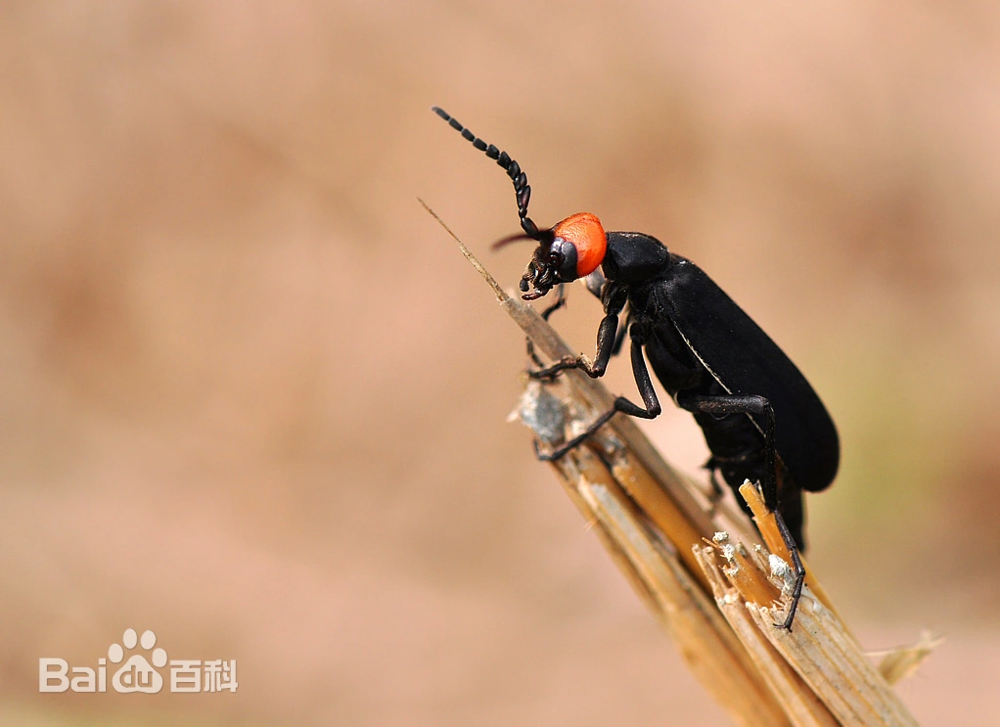
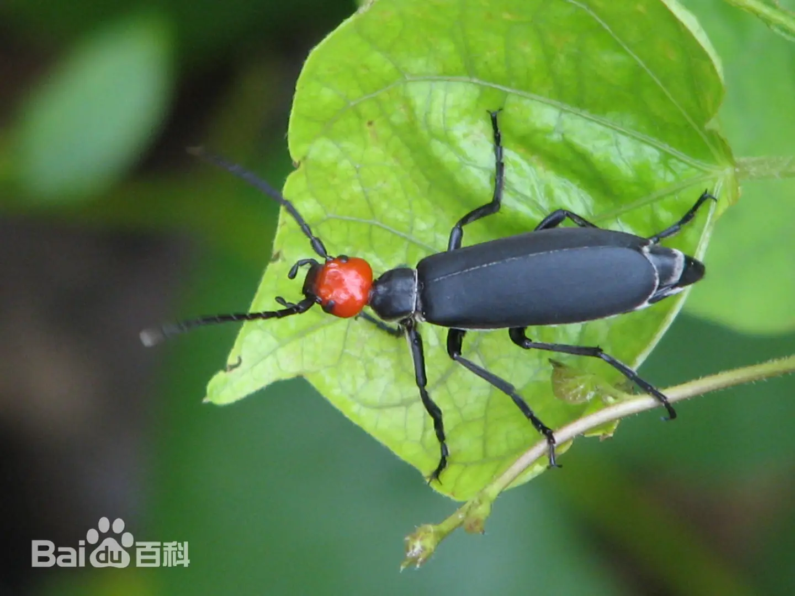
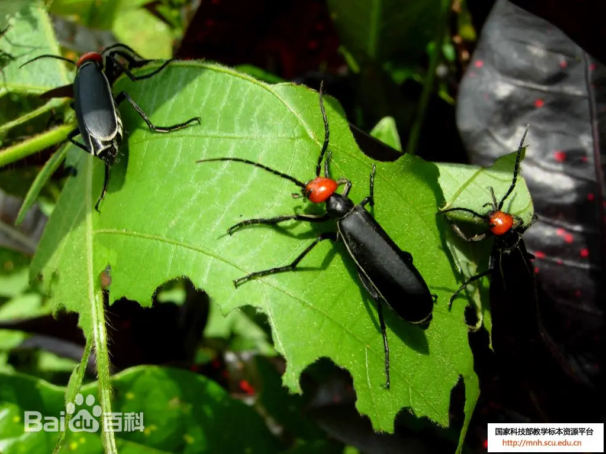
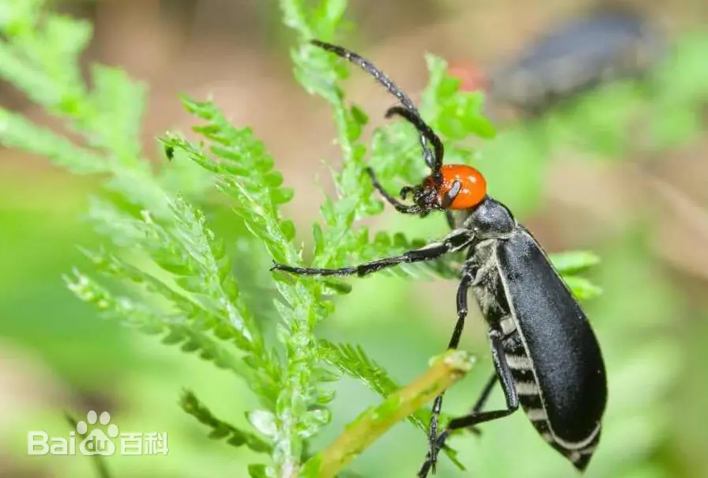

# 豆芫菁

|   中文名   | 豆芫菁                | 门     | 节肢动物门 Arthropoda |
| :--------: | --------------------- | ------ | --------------------- |
| **外文名** | Legume blister beetle | **纲** | 昆虫纲 Insecta        |
| **别  名** | 白条芫菁              | **目** | 鞘翅目                |
|            |                       | **科** | 芫菁科                |

## 特征

> **类别说明：**豆芫菁属于芫菁科。本文件描述的是“豆芫菁”这一具体识别类别，不能与上位类别“芫菁”通过字符串包含关系互相替代。

​	豆芫菁为[完全变态](https://baike.baidu.com/item/完全变态/3411657?fromModule=lemma_inlink)昆虫，生活史需经卵、幼虫、蛹及成虫四个阶段。体长约14至27毫米，体色除头部为红色外其他部分为单纯的黑色，身体部分地方具有灰色短绒毛。成虫主要於夏季出现在中低海拔地区，为[植食性昆虫](https://baike.baidu.com/item/植食性昆虫/9516767?fromModule=lemma_inlink)，经常成群出现在茎叶或花上啃食。

### 成虫

体长11～19mm，头部红色，胸腹和[鞘翅](https://baike.baidu.com/item/鞘翅/6468481?fromModule=lemma_inlink)均为黑色，头部略呈三角形，触角近基部几节暗红色，基部有1对黑色瘤状突起。雌虫触角丝状，雄虫触角第3～7节扁而宽。[前胸背板](https://baike.baidu.com/item/前胸背板/7826225?fromModule=lemma_inlink)中央和每个鞘翅都有1条纵行的黄白色纹。前胸两侧、鞘翅的周缘和腹部各节腹面的后缘都生有灰白色毛。

### 卵

长椭圆形，长约2.5～3mm，宽约0.9～1.2mm，初产乳白色，后变黄褐色，卵块排列成菊花状。

### 幼虫

[芫菁](https://baike.baidu.com/item/芫菁/3376092?fromModule=lemma_inlink)是[复变态](https://baike.baidu.com/item/复变态/2945918?fromModule=lemma_inlink)昆虫，各龄幼虫的形态都不相同。初龄幼虫似[双尾虫](https://baike.baidu.com/item/双尾虫/5463722?fromModule=lemma_inlink)，[口器](https://baike.baidu.com/item/口器/564821?fromModule=lemma_inlink)和[胸足](https://baike.baidu.com/item/胸足/6463919?fromModule=lemma_inlink)都发达，每足的末端都具3爪，腹部末端有1对长的尾须。2～4龄幼虫的胸足缩短，无爪和尾须，形似[蛴螬](https://baike.baidu.com/item/蛴螬/825521?fromModule=lemma_inlink)。第5龄似[象甲](https://baike.baidu.com/item/象甲/1377210?fromModule=lemma_inlink)幼虫，胸足呈[乳突](https://baike.baidu.com/item/乳突/6049717?fromModule=lemma_inlink)状。第6龄又似蛴螬，体长13～14mm，头部褐色，胸和腹部乳白色。

### 蛹

体长约16mm，全体灰黄色，[复眼](https://baike.baidu.com/item/复眼/5613416?fromModule=lemma_inlink)黑色。[前胸背板](https://baike.baidu.com/item/前胸背板/7826225?fromModule=lemma_inlink)后缘及侧缘各有长刺9根，第1～6[腹节](https://baike.baidu.com/item/腹节/5494958?fromModule=lemma_inlink)背面左右各有刺毛6根，后缘各生刺毛1排，第7～8腹节的左右各有刺毛5根。翅端达腹部第3节 [1]。

|  |  |  |  |
| --------------------------- | --------------------------- | --------------------------- | --------------------------- |

## 为害症状

​	豆芫菁以成虫为害大豆的叶片，尤喜食幼嫩部位。将叶片咬成孔洞或缺刻，甚至吃光，只剩网状[叶脉](https://baike.baidu.com/item/叶脉/6731913?fromModule=lemma_inlink)。豆芫菁为害嫩茎及[花瓣](https://baike.baidu.com/item/花瓣/74616?fromModule=lemma_inlink)，有的还吃豆粒，使其不能结实，对产量影响大。幼虫以蝗卵为食，是蝗虫的天敌。

## 防治方法

### 轻度

1. 加强玉米、豆类、花生等寄主作物巡查，尤其关注田边和杂草带。[14-T1][14-T2]
2. 少量群集时可人工或网捕；清晨低温时成虫活动较缓慢，更适合人工处理。[14-T1]
3. 捕捉时必须佩戴手套、长袖衣物，避免斑蝥素接触皮肤。[14-T1][14-T2]
4. 虫量较低时优先挑治，不必无差别全田施药。

### 中度

> 适用范围：以下内容仅作为当前确认样本的可选一般指导；不得依据当前样本自动选择治疗层级。涉及药剂时，须由用户确认目标作物并核对当前产品标签及登记适用范围。

1. 当出现明显群集取食和连续叶片缺刻时，集中处理虫体聚集区和周边杂草寄主。
2. 2026年山丹县病虫情报对豆芫菁给出了明确药剂示例：**2.5%溴氰菊酯微乳剂 20–30 mL/亩**，或**25 g/L 高效氯氟氰菊酯水乳剂 15–20 mL/亩**兑水喷雾。[14-T1]
3. 上述剂量只能在所购买产品当前标签仍登记于目标作物和豆芫菁/相关害虫时使用；否则以当前标签为准。
4. 施药避开高温、花期和授粉昆虫活动高峰，并轮换药剂作用机制。[14-T1]
### 重度

> 适用范围：以下内容仅针对当前确认样本及其可见组织；当前样本的重度观察不自动推断大面积、产量、采收期或区域防控。涉及药剂时，须由用户确认目标作物并核对当前产品标签及登记适用范围。

1. 可选择当前登记的拟除虫菊酯类或其他针对豆芫菁的合法产品开展规范喷雾；达川区植保情报也列出了高效氯氟氰菊酯及相关复配产品作为防控方向。[14-T2]
2. 严禁随意加大药量，严格执行安全间隔期并避开水源、养蜂区。[14-T1]
3. 对严重受害且无恢复价值的植株或组织，根据具体作物生产要求及时处理。
### 防治措施来源

**[14-T1] A**

title: 病虫情报第三期——加强田间虫情排查 严防虫害暴发危害

site: 山丹县人民政府 / 农业农村局

url: https://www.shandan.gov.cn/zfxxgk/fdzdgknr/qtfdxx/nync/202606/t20260618_1555195.html

**[14-T2] A**

title: 植保情报[2024]第14期：警惕食叶性害虫豆芫菁局部暴发危害

site: 达州市达川区人民政府 / 农业农村局

url: https://www.dachuan.gov.cn/xxgk-show-146920.html

##  危害

### 内容

**蚕食农业作物、 毒液引发皮肤溃烂、误食中毒风险**

### 内容来源：

title: 致命的調情聖手：芫青

site: 环境资讯中心

url: https://e-info.org.tw/node/62081

title: 豆芫菁咬了要警惕四种病

site: 百度健康·医学科普

url:https://m.baidu.com/bh/m/detail/ar_6521209895837810424?frsrcid=rec

title: 防病抗虫大作战11～豆芫菁

site: 大花蕙兰网

url:http://www.dahuahuilan.com/show.aspx?itemid=5642

## 可能诱因

### 内容

**幼虫阶段以地下蝗虫卵块等虫卵为食；夏季进入成虫主要活动期，周边存在豆科植物、蕨类、龙葵等适宜寄主植物，以及靠近中低海拔山地、林缘或开阔田野时，更容易观察到成虫群集取食。**

### 内容来源：

title:豆芫菁

site: 台湾环境资讯协会·自然谷

url:https://teia.tw/archives/natural_valley_star/ai2023-06-02

title: 豆芫青 Epicauta hirticornis

site: 嘎嘎昆虫网

url:http://gagaphoto.com/new23/9411/050.htm

title:怎样防治大豆豆芫菁

site: 种业商务网

url:https://www.chinaseed114.com/news/27/news_132355.html
